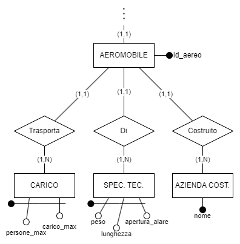
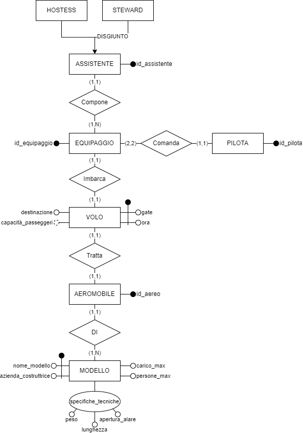

# Progetto basi di dati

---

## Analisi requisiti

Ci assicuriamo di gestire i voli di un aereoporto dal punto di vista dei gates, delegando al controllore di volo tutti gli aspetti relativi alla concorrenza di eventuali decolli contemporanei.

### Entità
- Volo
(**Ora**, **gate**, destinazione) (capacità passeggeri)

- Equipaggio 
(**ID_equipaggio**)

- Assistente
(**CF**)
    - Hostess 
    - Steward

- Pilota
(**CF**)

- Aereo
(**ID_Aereo**)

- Modello
(**Nome_modello**, **Azienda_costruttrice**, carico_max, persone_max)

### Attributi composti
specifiche_tecniche: (peso, lunghezza, apertura_alare)

### Relazioni

|     E1     | Cardinalità |  Relazione  | Cardinalità |     E2     |
|:----------:|:-----------:|:-----------:|:-----------:|:----------:|
|    Volo    |    (1,1)    | **Imbarca** |    (1,1)    | Equipaggio |
| Aeromobile |    (1,1)    | **Tratta**  |    (1,1)    |    Volo    |
| Aeromobile |    (1,1)    |   **Di**    |    (1,n)    |  Modello   |
|   Pilota   |    (1,1)    | **Comanda** |    (2,2)    | Equipaggio |
| Assistente |    (1,1)    | **Compone** |    (1,n)    | Equipaggio |

### Operazioni

1. **cambio_gate**
    - Dato un volo sostituisce il numero del gate corrente con uno aggiornato

2. **cambio_aeromobile**
    - Dato un volo sostituisce l'aeromobile assegnata alla tratta con un nuovo aeromobile

3. **ricerca_voli_gate**
    - Dato un gate restituisce l'elenco dei voli programmati in giornata

4. **ricerca_voli_destinazione**
    - Data una destinazione restituisce l'elenco dei dei voli che partono in giornata e la raggiungono

5. **ricerca_voli_odierni**
    - Restituisce l'elenco dei voli in partenza in giornata

6. **elimina_volo**
    - Dato un volo, lo elimina per sempre

7. **Inserisci_volo**
    - Inserisce un volo nel database

**operazioni complesse**

8. **Steward_Aerei_Pesanti**
    - Il numero di steward che lavorano su voli che fanno tratte con aerei con peso almeno X e al massimo Y

9. **Aerei_Di_Linea**
    - Gli aerei con "_persone_max_" minimo comandati da piloti con età compresa fra 30 e 60 inclusi

10. **Piloti_Cargo**
    - I piloti che comandano aerei con "carico_max" superiore a X e con un numero di assistenti inferiore a Y

## Schema Entità-Relazioni

### Prototipo

perche non ha funzionato

### Schema finale

## Regole di derivazione

### RD1 **capacità passeggeri**
Dato un volo, ricercare l'aeromobile, ottenere modello, derivare numero massimo di persone come 

**da riscrivere**
Dato un volo, ritorna il numero massimo di passeggeri imbarcabili.

Capacità passeggeri si ottiene con persone_max meno numero di persone nell'equipaggio.

## Vincoli di integrità

### RV1 **Equipaggio non eccede persone_max**
In ogni il numero di persone che compone l'equipaggio deve essere minore o uguale al numero massimo di persone trasportabili dall'aereomobile.

### RV2 **Cardinalità hostess-steward**
L'entità "EQUIPAGGIO" deve avere almeno uno fra hostess e steward.

---

### Tabella dei volumi

|  Concetto   |   Tipo    | Volume |
|:-----------:|:---------:|:------:|
| Aeromobile  |  Entità   |   20   |
| Assistente  |  Entità   |   80   |
| Equipaggio  |  Entità   |   20   |
|   Modello   |  Entità   |   10   |
|   Pilota    |  Entità   |   40   |
|    Volo     |  Entità   |   20   |
|   Comanda   | Relazione |   40   |
|   Compone   | Relazione |   80   |
|     Di      | Relazione |   20   |
|   Imbarca   | Relazione |   20   |
|   Tratta    | Relazione |   20   |

#### Note
- Il numero dei piloti deve essere il doppio rispetto al numero degli equipaggi per via della cardinalità (2,2) della relazione

### Tabella delle frequenze

da scegliere noi ... (no vincoli)

## Analisi ridondanze

Capacità_passeggeri è un attributo interessante da analizzare perché richiede la visita di gran parte dello schema(**schema ?**)

### Operazioni di ridondanza

1. Inserisci un nuovo assistente
2. Dato un volo ritorna "capacità_passeggeri"

(specifica ridondanze, calcolo ridondanze)

(il costo write= 2 read 1w = $2\mu$, 1w = $1\mu$)

(definire il punto di rottura delle frequenze: quando conviene mantenere ridondanza o eliminarla)

## Schema logico

Aereomobile(**id_aereo**, _Modello_, )
Assistente(**id_assistente**)
Equipaggio(**id_equipaggio**, _Equipaggio_)
Modello(**nome_modello**, **azienda_costruttrice**, carico_max, persone_max)
Pilota(**id_pilota**)
Volo(**gate**, **ora**, destinazione, capacità_passeggeri)

## Vincoli di dominio

1. **VOLO**

|        Ora         |      Gate      | Destinazione |
|:------------------:|:--------------:|:------------:|
| [0, 60 $\cdot$ 24] | [1, max_gates] |      ~       |

2. **MODELLO**

| Nome_modello | Azienda_costruttrice | Persone_max | Carico_max | Peso  | Lunghezza | Apertura_alare |
|:------------:|:--------------------:|:-----------:|:----------:|:-----:|:---------:|:--------------:|
|      ~       |          ~           |   x >= 3    |   x > 0    | x > 0 |   x > 0   |     x > 0      |

---

## Dizionario dei dati

|   Entità   | Descrizione                                            |                                        Attributi                                        |      Identificatore       |
|:----------:|:-------------------------------------------------------|:---------------------------------------------------------------------------------------:|:-------------------------:|
|    Volo    | Volo che parte ogni giorno alla stessa ora             |                     ora, destinazione, gate, _capacità\_passeggeri_                     |         gate, ora         |
| Aeromobile | Aeromobile coinvolto nel volo                          |                                      id_assistente                                      |       id_assistente       |
|  Modello   | Modello specifico dell'aeromobile                      | name, azienda, carico_max, persone_max, spec_tecniche (peso, lunghezza, apertura_alare) |nome, azienda_costruttrice |
| Equipaggio | Equipaggio che imbarca l'aeromobile                    |                                      id_equipaggio                                      |       id_equipaggio       |
|   Pilota   | Piloti che pilotano l'aeromobile                       |                                        id_pilota                                        |         id_pilota         |
| Assistente | Assistente (steward e/o hostess) che assistono il volo |                                      id_assistente                                      |       id_assistente       |
|  Steward   | Assistente maschile                                    |                                            ~                                            |             ~             |
|  Hostess   | Assistente femminile                                   |                                            ~                                            |             ~             |

# Domande 

Le operazioni che usiamo per l'analisi della ridondanza, vanno implementate o no?