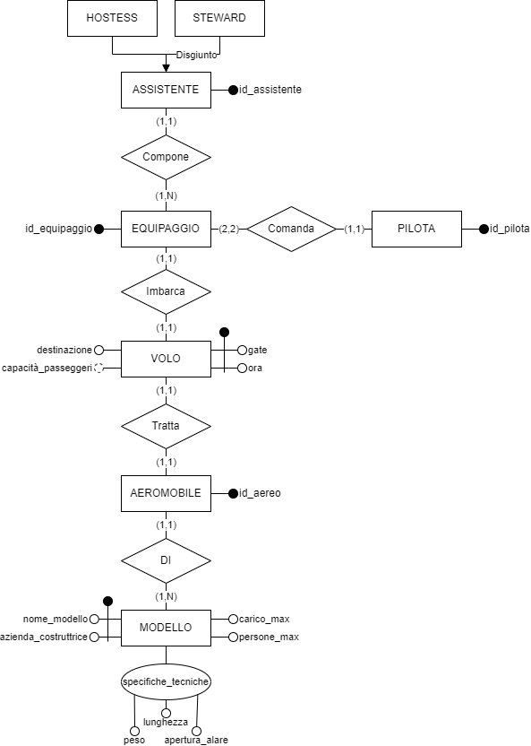

# Progetto basi di dati

---

## Analisi requisiti

Ci assicuriamo di gestire i voli di un aereoporto dal punto di vista dei gates, delegando al controllore di volo tutti gli aspetti relativi alla concorrenza di eventuali decolli contemporanei.

### Entità
- Volo
(**Ora**, **gate**, destinazione) (capacità passeggeri)

- Equipaggio (**ID**)

- Assistente
(**ID**)
    - Hostess 
    - Steward
- Pilota
(**ID**)
- Aereo
(**ID**)
- Modello
(**Nome_modello**, **Azienda_costruttrice**, carico_max, persone_max)

### Attributi composti
specifiche_tecniche: (peso, lunghezza, apertura_alare)

### Relazioni
- Volo (1,1) imbarca (1,1) Equipaggio
- Aeromobile (1,1) Tratta (1,1) Volo
- Aeromobile (1,1) Di (1,n) Modello
- Equipaggio (2,2) Comanda (1,1) Pilota
- Equipaggio (1,n) Compone (1,1) Assistente

### Operazioni

1. **cambio_gate**
2. **cambio_aeromobile**
3. **ricerca_voli_gate**
4. **ricerca_voli_destinazione**
5. **ricerca_voli_odierni**
6. **elimina_volo**
7. **Inserisci_volo**

## Schema Entità-Relazioni

img schema 1
perche non ha funzionato

## Regole di derivazione

### RD1 **capacità passeggeri**
Dato un volo, ricercare l'aeromobile, ottenere modello, derivare numero massimo di persone come 

Dato un volo, ritorna il numero massimo di passeggeri imbarcabili.

Capacità passeggeri si ottiene con persone_max meno numero di persone nell'equipaggio.

## Vincoli di integrità

### RV1 **Equipaggio non eccede persone_max**
In ogni il numero di persone che compone l'equipaggio deve essere minore o uguale al numero massimo di persone trasportabili dall'aereomobile.

---

### Tabella dei volumi

|  Concetto   |   Tipo    | Volume |
|:-----------:|:---------:|:------:|
| Aereomobile |  Entità   |   20   |
| Assistente  |  Entità   |   80   |
| Equipaggio  |  Entità   |   20   |
|   Modello   |  Entità   |   20   |
|   Pilota    |  Entità   |   40   |
|    Volo     |  Entità   |   20   |
|   Comanda   | Relazione |   20   |
|   Compone   | Relazione |   20   |
|     Di      | Relazione |   20   |
|   Imbarca   | Relazione |   20   |
|   Tratta    | Relazione |   20   |

## Schema logico

Aereomobile(**id_aereo**, _Modello_, )
Assistente(**id_assistente**)
Equipaggio(**id_equipaggio**, _Equipaggio_)
Modello(**nome_modello**, **azienda_costruttrice**, carico_max, persone_max)
Pilota(**id_pilota**)
Volo(**gate**, **ora**, destinazione, capacità_passeggeri)

## Vincoli di dominio

1. **VOLO**

|        Ora         |      Gate      | Destinazione |
|:------------------:|:--------------:|:------------:|
| [0, 60 $\cdot$ 24] | [1, max_gates] |              |

2. **MODELLO**

|  Nome_modello  | Azienda_costruttrice | Persone_max | Carico_max | Peso  | Lunghezza | Apertura_alare |
|:--------------:|:--------------------:|:-----------:|:----------:|:-----:|:---------:|:--------------:|
|                |                      |   x >= 3    |   x > 0    | x > 0 |   x > 0   |     x > 0      |

---

## Dizionario dei dati

|   Entità   | Descrizione                                            |                                        Attributi                                        |      Identificatore       |
|:----------:|:-------------------------------------------------------|:---------------------------------------------------------------------------------------:|:-------------------------:|
|    Volo    | Volo che parte ogni giorno alla stessa ora             |                     ora, destinazione, gate, _capacità\_passeggeri_                     |         gate, ora         |
| Aeromobile | Aeromobile coinvolto nel volo                          |                                      id_assistente                                      |       id_assistente       |
|  Modello   | Modello specifico dell'aeromobile                      | name, azienda, carico_max, persone_max, spec_tecniche (peso, lunghezza, apertura_alare) |nome, azienda_costruttrice |
| Equipaggio | Equipaggio che imbarca l'aeromobile                    |                                      id_equipaggio                                      |       id_equipaggio       |
|   Pilota   | Piloti che pilotano l'aeromobile                       |                                        id_pilota                                        |         id_pilota         |
| Assistente | Assistente (steward e/o hostess) che assistono il volo |                                      id_assistente                                      |       id_assistente       |
|  Steward   | Assistente maschile                                    |                                            ~                                            |             ~             |
|  Hostess   | Assistente femminile                                   |                                            ~                                            |             ~             |

