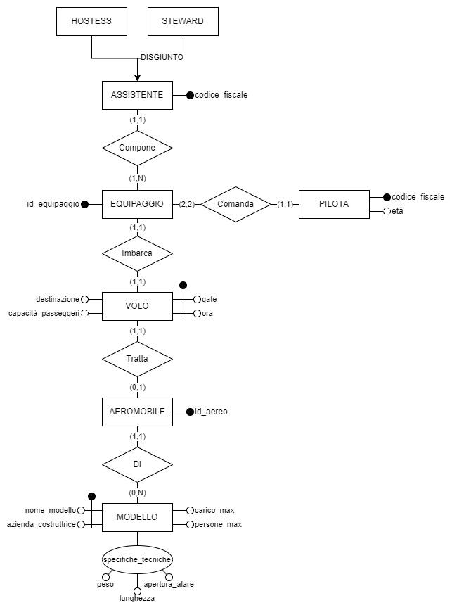

# `Gruppo 29`

# 1 Analisi dei requisiti

## 1.1 Sintesi del testo
Si vuole realizzare una basi di dati per un piccolo aeroporto, del quale vogliamo rappresentare i dati relativi ai voli, all’equipaggio e agli aeromobili che effettuano i voli. 
Di ogni volo specifichiamo la destinazione e l’orario di partenza. Assumiamo inoltre, che ogni volo venga svolto ogni giorno della settimana, sempre nello stesso orario, ma che da un giorno all’altro possano cambiare il cancello d’uscita (gate) e l’aeromobile utilizzato. Ogni volo ha orario di partenza e gate unici (cioè, che nessun altro volo può partire allo stesso orario sullo stesso gate e viceversa) e viene effettuato da un equipaggio specifico. 
Ogni equipaggio è formato da due piloti, zero, una o più hostess, zero, uno o più steward. I due piloti e almeno una hostess o uno steward devono essere sempre presenti. Identifichiamo gli equipaggi mediante idonei codici identificativi. Per hostess e steward rappresentiamo il codice fiscale, e per i piloti, l’età e il codice fiscale. 
Di ogni aeromobile utilizzato, identificato da un opportuno codice, memorizziamo l’azienda costruttrice e il modello, con le sue caratteristiche tecniche: la capacità (numero massimo di passeggeri e quantità massima di materiale trasportabile) e le caratteristiche tecniche (peso, lunghezza e apertura alare). Ogni aeromobile effettua un unico volo al giorno.

## 1.2 Glossario
| Termine              | Descrizione                                             | Sinonimi |          Collegamenti           |
|:---------------------|:--------------------------------------------------------|:--------:|:-------------------------------:|
| Volo                 | Volo in partenza dall'aeroporto                         |    ~     |     Aeromobile, Equipaggio      |
| Aeromobile           | Aereo che effettua un volo                              |  Aereo   |          Volo, Modello          |
| Modello              | Modello di un aeromobile                                |    ~     | Aeromobile, Specifiche tecniche |
| Specifiche tecniche  | Peso, apertura alare e lunghezza relative ad un modello |    ~     |             Modello             |
| Equipaggio           | Insieme di persone che gestiscono un volo               |    ~     |    Volo, Pilota, Assistente     |
| Pilota               | Persona che pilota un aereo e fa parte di un equipaggio |    ~     |           Equipaggio            |
| Assistente           | Persona che assiste i passeggeri di un volo             |    ~     |  Equipaggio, Hostess, Steward   |
| Hostess              | Assistente di sesso femminile                           |    ~     |           Assistente            |
| Steward              | Assistente di sesso maschile                            |    ~     |           Assistente            |
| Gate                 | Cancello d'imbarco                                      |    ~     |              Volo               |
| Azienda_costruttrice | Azienda che costruisce modelli di aeromobili            |    ~     |             Modello             |

## 1.3 Specifiche sui dati
|                                                                            Frasi di carattere generale                                                                            |
|:---------------------------------------------------------------------------------------------------------------------------------------------------------------------------------:|
| Si vuole realizzare una basi di dati per un piccolo aeroporto, del quale vogliamo rappresentare i dati relativi ai voli, all’equipaggio e agli aeromobili che effettuano i voli.  |

|                                                                                                                                                                                                                        Frasi relative ai voli                                                                                                                                                                                                                         |
|:---------------------------------------------------------------------------------------------------------------------------------------------------------------------------------------------------------------------------------------------------------------------------------------------------------------------------------------------------------------------------------------------------------------------------------------------------------------------:|
| Di ogni volo specifichiamo la destinazione e l’orario di partenza. Assumiamo inoltre, che ogni volo venga svolto ogni giorno della settimana, sempre nello stesso orario, ma che da un giorno all’altro possano cambiare il cancello d’uscita (gate) e l’aeromobile utilizzato. Ogni volo ha orario di partenza e gate unici(cioè, che nessun altro volo può partire allo stesso orario sullo stesso gate e viceversa) e viene effettuato da un equipaggio specifico. |

|                                                                                                                                                          Frasi relative agli equipaggi                                                                                                                                                           |
|:------------------------------------------------------------------------------------------------------------------------------------------------------------------------------------------------------------------------------------------------------------------------------------------------------------------------------------------------:|
| Ogni equipaggio è formato da due piloti, zero, una o più hostess, zero, uno o più steward. I due piloti e almeno una hostess o uno steward devono essere sempre presenti. Identifichiamo gli equipaggi mediante idonei codici identificativi. Per hostess e steward rappresentiamo il codice fiscale, e per i piloti, l’età e il codice fiscale. |

|                                                                                                                                                                     Frasi relative agli aeromobili                                                                                                                                                                      |
|:-----------------------------------------------------------------------------------------------------------------------------------------------------------------------------------------------------------------------------------------------------------------------------------------------------------------------------------------------------------------------:|
| Di ogni aeromobile utilizzato, identificato da un opportuno codice, memorizziamo l’azienda costruttrice e il modello, con le sue caratteristiche tecniche: la capacità (numero massimo di passeggeri e quantità massima di materiale trasportabile) e le caratteristiche tecniche (peso, lunghezza e apertura alare). Ogni aeromobile effettua un unico volo al giorno. |

## 1.4 Specifiche sulle operazioni

_**Operazioni base**_

1. **cambio_gate**
    - Dato un volo sostituisce il numero del gate corrente con uno aggiornato (operazione da effettuare in media 2 volte al giorno)

2. **cambio_aeromobile**
    - Dato un volo sostituisce l'aeromobile assegnata alla tratta con un nuovo aeromobile (2 volte al giorno)

3. **ricerca_voli_gate**
    - Dato un gate restituisce l'elenco dei voli programmati in giornata (circe 1000 volte al giorno)

4. **ricerca_voli_destinazione**
    - Data una destinazione restituisce l'elenco dei voli che partono in giornata e la raggiungono (circa 5000 volte al giorno)

5. **ricerca_voli_odierni**
    - Restituisce l'elenco dei voli in partenza in giornata (5000 volte al giorno) 

6. **elimina_volo**
    - Dato un volo, lo elimina per sempre (2 volte al giorno)

7. **Inserisci_volo**
    - Inserisce un volo nel database (2 volte al giorno)

_**Operazioni complesse**_

1. **Steward_Aerei_Pesanti**
    - Il numero di steward che lavorano su voli che fanno tratte con aerei con peso almeno X e al massimo Y (operazione svolta 10 volte al giorno)

2. **Aerei_Di_Linea**
    - Gli aerei con "_persone_max_" minimo comandati da piloti con età compresa fra 30 e 60 inclusi (10 volte al giorno)

3. **Piloti_Cargo**
    - I piloti che comandano aerei con "carico_max" superiore a X e con un numero di assistenti inferiore a Y (10 volte al giorno)

# 2 Progettazione concettuale

## 2.1 Schema Entità-Relazioni

La creazione dello schema _Entità-relazioni_ ha seguito un approccio _bottom-up_. Per ogni _entità_ si sono prima decisi gli attributi principali e poi i collegamenti alle altre _entità_ tramite _relazioni_ fino ad arrivare ad un prototipo di schema funzionante. 

Questo prototipo è stato rivisto e ottimizzato per migliorare la coerenza logica rispetto al caso d'uso.

### 2.1.1 Prima revisione

La proposta iniziale del nostro schema _ER_ prevedeva la suddivisione delle caratteristiche dell'aeromobile in tre entità separate, con l'obiettivo di conferire al modello una maggiore modularità.

Tuttavia questo approccio comportava un'eccessiva complessità dello schema, per cui abbiamo deciso di scartare questa proposta.

### 2.1.2 Schema ER 

La suddivisione delle caratteristiche dell'aeromobile in entità distinte è stata eliminata a favore di un'entità _MODELLO_ con attributi singoli _nome\_modello_,  _casa\_costruttrice_, _carico\_max_ e  _persone\_max_, mentre _peso_, _lunghezza_ e _apertura\_alare_ sono stati inglobati nell'attributo composto _specifiche\_tecniche_

Nello schema sono presenti gli attributi disgiunti _HOSTESS_ e _STEWARD_ collegati ad _ASSISTENTE_.  Questa separazione permette di distinguere tra assistenti di genere femminile e maschile all'interno del sistema.

Per garantire che ad ogni equipaggio siano assegnati esattamente 2 piloti è presente la cardinalità $(2,2)$ fra:
$$
EQUIPAGGIO \xrightarrow{(2,2)}  comanda \xrightarrow{(1,1)} PILOTA
$$

All'interno di _PILOTA_ è presente un attributo derivato _età_ che è calcolabile in base al codice fiscale contenuto nell'attributo _codice\_fiscale_.

Anche in _VOLO_ è presente un attributo derivato, si tratta di _capacità\_passeggeri_ che è calcolabile tramite la formula:

$$
capacità\_passeggeri= persone\_max - (|EQUIPAGGIO| + |PILOTI|)
$$

in cui:

- $persone\_max$: numero massimo di persone trasportabili dal modello (_MODELLO.persone\_max_)
- $|EQUIPAGGIO|$: cardinalità di persone imbarcate come equipaggio dell'aereo
- $|PILOTI|$: cardinalità dei piloti, in questo caso sempre 2

 

### 2.1.3 Tabella di cardinalità delle relazioni

|     E1     | Cardinalità |  Relazione  | Cardinalità |     E2     |
|:----------:|:-----------:|:-----------:|:-----------:|:----------:|
|    Volo    |    (1,1)    | **Imbarca** |    (1,1)    | Equipaggio |
| Aeromobile |    (1,1)    | **Tratta**  |    (1,1)    |    Volo    |
| Aeromobile |    (1,1)    |   **Di**    |    (1,n)    |  Modello   |
|   Pilota   |    (1,1)    | **Comanda** |    (2,2)    | Equipaggio |
| Assistente |    (1,1)    | **Compone** |    (1,n)    | Equipaggio |

 

## 2.2 Documentazione schema E-R

### 2.2.1 Dizionario dei dati
|       Entità        | Descrizione                                            |                                                  Attributi                                                  |           Identificatore           |
|:-------------------:|:-------------------------------------------------------|:-----------------------------------------------------------------------------------------------------------:|:----------------------------------:|
|        Volo         | Volo che parte ogni giorno alla stessa ora             |                               gate, ora, destinazione, _capacità\_passeggeri_                               |             gate, ora              |
|     Aeromobile      | Aeromobile coinvolto nel volo                          |                                                  id_aereo                                                   |              id_aereo              |
|       Modello       | Modello specifico dell'aeromobile                      | nome_modello, azienda_costruttrice, carico_max, persone_max, spec_tecniche(peso, lunghezza, apertura_alare) | nome_modello, azienda_costruttrice |
|     Equipaggio      | Equipaggio che imbarca l'aeromobile                    |                                                id_equipaggio                                                |           id_equipaggio            |
|       Pilota        | Piloti che pilotano l'aeromobile                       |                                            codice_fiscale, eta'                                             |           codice_fiscale           |
|     Assistente      | Assistente (steward e/o hostess) che assistono il volo |                                               codice_fiscale                                                |           codice_fiscale           |
|       Steward       | Assistente maschile                                    |                                                      ~                                                      |                 ~                  |
|       Hostess       | Assistente femminile                                   |                                                      ~                                                      |                 ~                  |

### 2.2.2 Regole di vincolo

| Regole di vincolo                                                                                                                                                |     
|------------------------------------------------------------------------------------------------------------------------------------------------------------------|
| **(RV1)** - Il numero di persone che compone l'equipaggio deve essere minore o uguale al numero massimo di persone trasportabili dall'aeromobile con cui volano. |
| **(RV2)** - L'entità "EQUIPAGGIO" deve sempre includere almeno un membro fra hostess e steward.                                                                  |

### 2.2.3 Regole di derivazione

| Regole di derivazione                                                                                                                                                                                                                                                                                                                                                                                                                                                                                                                      |     
|--------------------------------------------------------------------------------------------------------------------------------------------------------------------------------------------------------------------------------------------------------------------------------------------------------------------------------------------------------------------------------------------------------------------------------------------------------------------------------------------------------------------------------------------|
| **(RD1)** - L'attributo "capacita'_passeggeri" in "VOLO" descrive la capacità massima di passeggeri imbarcabili da un aeromobile. Per derivarlo, di un volo, si ricerca il modello dell'aeromobile, da cui si ottiene il numero massimo di persone che quell'aeromobile puo' trasportare usando l'attributo "persone_max". A questo valore viene sottratto il numero di assistenti che quel volo imbarca. In questo modo si puo' derivare l'attributo "capacita'_passeggeri". [ capacità_passeggeri = MODELLO(_persone_max_) - #assistenti] |
| **(RD2)** - L'attributo "eta'" in "PILOTA" indica l'eta' del pilota; si ricava dal codice fiscale del pilota, estrapolando il settimo e ottavo carattere (che rappresentano le ultime due cifre dell'anno di nascita), l'ottavo carattere (che rappresenta il mese) e infine decimo e undicesimo carattere (che rappresentano il giorno di nascita). L'ottavo carattere rappresenta il mese di nascita secondo la tabella di conversione dell'agenzia delle entrate - A, B, C, D, E, H designano i primi 6 mesi dell'anno e L, M, P, R, S, T gli ultimi 6 mesi dell'anno.                                                                                                                                                                                                                                                                                                                                                                                                                                   |

 
 

# 3 Progettazione logica

## 3.1 Operazioni

_**Operazioni base**_

1. **cambio_gate**: Dato un volo sostituisce il numero del gate corrente con uno aggiornato
2. **cambio_aeromobile**: Dato un volo sostituisce l'aeromobile assegnata alla tratta con un nuovo aeromobile
3. **ricerca_voli_gate**: Dato un gate restituisce l'elenco dei voli programmati in giornata
4. **ricerca_voli_destinazione**: Data una destinazione restituisce l'elenco dei voli che partono in giornata e la raggiungono
5. **ricerca_voli_odierni**: Restituisce l'elenco dei voli in partenza in giornata
6. **elimina_volo**: Dato un volo, lo elimina per sempre
7. **Inserisci_volo**: Inserisce un volo nel database 

_**Operazioni complesse**_

1. **steward_aerei_pesanti**: Il numero di steward che lavorano su voli che fanno tratte con aerei con peso almeno X e al massimo Y 
2. **aerei_di_linea**: Gli aerei con "_persone_max_" minimo comandati da piloti con età compresa fra 30 e 60 inclusi
3. **piloti_cargo**: I piloti che comandano aerei con "carico_max" superiore a X e con un numero di assistenti inferiore a Y

 

## 3.2 Fase di ristrutturazione

### 3.2.1 Tabella dei volumi

|  Concetto  |   Tipo    | Volume |
|:----------:|:---------:|:------:|
| Aeromobile |  Entità   |   20   |
| Assistente |  Entità   |   80   |
| Equipaggio |  Entità   |   20   |
|  Modello   |  Entità   |   10   |
|   Pilota   |  Entità   |   40   |
|    Volo    |  Entità   |   20   |
|  Comanda   | Relazione |   40   |
|  Compone   | Relazione |   80   |
|     Di     | Relazione |   20   |
|  Imbarca   | Relazione |   20   |
|   Tratta   | Relazione |   20   |

 

### 3.2.2 Tabella delle frequenze
| Operazione                 | Tipo        | Frequenza (giornaliera) |
|:---------------------------|-------------|:-----------------------:|
| Cambio Gate                | Interattiva |            2            |
| Cambio Aereo               | Interattiva |            2            |
| Ricerca Voli(gate)         | Interattiva |          1000           |
| Ricerca Voli(Destinazione) | Interattiva |          5000           |
| Ricerca Voli Odierni       | Interattiva |          5000           |
| Elimina Volo               | Interattiva |            2            |
| Inserisci Volo             | Interattiva |            2            |
| N° Steward Aerei Pesanti   | Interattiva |           10            |
| Aerei di Linea             | Interattiva |           10            |
| Piloti Cargo               | Interattiva |           10            |

 

### 3.2.3 Analisi di ridondanza

[Analisi di ridondanza docs](https://docs.google.com/document/d/1nhvOKPnkAEypN998Kzv5q8iw8WVj2o3czqGw2cCtgTw/edit?usp=sharing)

Osservando lo schema della base di dati si nota come l'attributo "capacità_passeggeri" associato all'entità "VOLO", possa essere derivabile. Per valutare se convenga mantenere la ridondanza del dato, è stata condotta un'analisi di ridondanza.

 

#### Scenari

**Attributo derivato mantenuto**: il calcolo della capacità passeggeri avviene ogni volta che viene inserito un nuovo volo nella base di dati. Tuttavia, ogni successiva richiesta di capacità passeggeri verrà’ eseguita in tempo costante con una singola lettura.

**Senza attributo derivato**: l'inserimento dei voli è rapido e avviene in tempo costante. Tuttavia, la richiesta di capacità passeggeri comporta il suo ricalcolo ogni volta, incidendo sulla velocità di risposta.

 

#### Operazioni
Le due operazioni prese in esame:

**Operazione 1 (OP1)**: Inserimento di un nuovo volo nella base di dati.
**Operazione 2 (OP2)**: Richiesta del numero di passeggeri che possono imbarcarsi su un dato volo.

 

#### Volumi
Durante il calcolo, è essenziale considerare anche il numero medio di assistenti per ogni volo. Consultando la tabella dei volumi, si nota che vengono svolti 20 voli in una giornata e gli assistenti nella base di dati sono 80, ciò implica una media di 4 assistenti per volo.

$n= \frac{assistenti}{voli}= \frac{80}{20}=4$

Ulteriori dati relativi ai volumi utilizzati nei calcoli sono registrati nella tabella apposita.

 

#### Frequenze
Il numero delle frequenze giornaliere con le quali vengono svolte le operazioni deve anch'esso essere ragionevole. In questo caso, si è ipotizzato l'inserimento di 5 voli al giorno e la richiesta del numero di passeggeri per ogni volo, 50 volte al giorno.

- $freq(OP1)=5$ (vengono inseriti 5 voli al giorno)
- $freq(OP2)=50$  (vengono fatte 50 richieste al giorno)

 

#### Costi di lettura e scrittura
Supponendo che la lettura della nostra base di dati implichi una spesa pari alla metà di quella necessaria per una scrittura, i costi relativi sono:

- $(read) 1R=1\mu$
- $(write) 1W =2\mu$

 

#### Analisi dei costi

##### Tavola degli accessi in presenza di ridondanza

_OP1_

| Concetto   | Costrutto | Accessi | Tipo |
|------------|:---------:|:-------:|:----:|
| Volo       |     E     |    1    |  W   |
| Aeromobile |     E     |    1    |  R   |
| Modello    |     E     |    1    |  R   |
| Equipaggio |     E     |    1    |  R   |
| Assistente |     E     |    4    |  R   |

_OP2_

| Concetto   | Costrutto | Accessi | Tipo |
|------------|:---------:|:-------:|:----:|
| Volo       |     E     |    1    |  R   |

 

##### Tavola degli accessi in assenza di ridondanza

_OP1_

| Concetto   | Costrutto | Accessi | Tipo |
|------------|:---------:|:-------:|:----:|
| Volo       |     E     |    1    |  W   |

_OP2_

| Concetto   | Costrutto | Accessi | Tipo |
|------------|:---------:|:-------:|:----:|
| Volo       |     E     |    1    |  R   |
| Aeromobile |     E     |    1    |  R   |
| Modello    |     E     |    1    |  R   |
| Equipaggio |     E     |    1    |  R   |
| Assistente |     E     |    4    |  R   |

 

##### Costo operazioni con ridondanza
Nel contesto dello scenario che prevede l'utilizzo dell'attributo derivato, il costo per le due operazioni è così definito:

$$
\begin{cases}
cost(OP1CR)&=1W+2R+1R+nR \\
cost(OP2CR)&=1R
\end{cases}
$$

L'operazione $OP1_{CR}$ (con ridondanza) ha un costo iniziale di 1W, derivante dalla scrittura di un nuovo volo nell'entità "VOLO". Successivamente, l'operazione effettua due letture per ottenere la capacità massima di persone del modello di aeromobile associato a quel volo. Queste letture coinvolgono prima l'entità "AEROMOBILE" e successivamente l'entità "MODELLO". Infine, l'operazione determina il numero del personale che compone l'equipaggio, leggendo l'entità "EQUIPAGGIO" e gli $n$ assistenti associati a tale equipaggio. È importante notare che l'equipaggio è sempre composto da esattamente due piloti, evitando quindi ulteriori letture per questa categoria di personale..

L'operazione $OP2_{CR}$ ha un costo molto basso poiché legge direttamente l'attributo derivato presente nell'entità "VOLI".

Il costo totale nel caso in cui è mantenuta la ridondanza risulta quindi:

$$
\begin{equation}
\begin{aligned}
TOT_1 &=freq(OP1) \cdot cost(OP1_{CR}) + freq(OP2) \cdot cost(OP2_{CR}) \\
&=5 \cdot (1W+3R+nR) + 50 \cdot (1R) \\
&=5 \cdot (2\mu + 3\mu + 4\mu) + 50 \cdot (1\mu) \\
&=10\mu + 15\mu + 20\mu + 50\mu \\
&=95\mu \\
\end{aligned}
\end{equation}
$$

##### Costo operazioni senza ridondanza
Nel contesto dello scenario in cui non si fa uso dell'attributo derivato, il costo per le due operazioni è il seguente:

$$
\begin{cases}
cost(OP1SR)=1W \\
cost(OP2SR)=1R+2R+1R+nR
\end{cases}
$$

In questo caso, si nota che $OP1_{SR}$ (senza ridondanza) ha un costo di 1W, dovuto alla scrittura del volo nell'entità "VOLO".

L'operazione $OP2_{SR}$, al contrario, deve contare il numero del personale che compone l'equipaggio, seguendo lo stesso processo descritto nel caso con ridondanza.

Il costo totale nel caso in cui viene eliminata la ridondanza risulta quindi:

$$
\begin{equation}
\begin{aligned}
TOT_2 &=freq(OP1) \cdot cost(OP1_{SR}) + freq(OP2) \cdot cost(OP2_{SR})\\
&=5 \cdot (1W) + 50 \cdot (1R+2R+1R+nR) \\
&=5 \cdot (2\mu) + 50 \cdot (4\mu + 4\mu) \\
&=10\mu + 200\mu + 200\mu \\
&=410\mu\\
\end{aligned}
\end{equation}
$$

 

#### Conclusione dell'analisi di ridondanza
Dai calcoli effettuati, possiamo dedurre che in una giornata in cui vengono rispettate le frequenze assegnate, ovvero $freq(OP1)=5$ e $freq(OP2)=50$, risulta vantaggioso utilizzare l'approccio con ridondanza, in quanto abbatte il costo a circa un quarto del tempo utilizzato altrimenti.
Mantenere il dato comporta un costo finale di $95\mu$ (vedi $EQ.1$), mentre ricavarlo ogni volta costa $410 \mu$ (vedi $EQ.2$).

 

#### Ulteriori riflessioni

Ora, mediante l'inclusione di un grafico, esamineremo quando conviene adottare un approccio rispetto all'altro. Considerando che la funzione che determina il costo complessivo delle operazioni dipende da due parametri, $freq(OP1)$ e $freq(OP2)$, abbiamo optato per fissare il valore della frequenza per la prima operazione, variando invece la frequenza della seconda. Questa scelta è motivata dal fatto che riteniamo la frequenza della seconda operazione più variabile rispetto alla prima.

Dal grafico, è evidente che eliminare la ridondanza è conveniente solo quando la frequenza dell'operazione $OP2$ (richieste sulla capacità passeggeri di un volo) non supera le cinque occorrenze. Al di là di questo punto, diventa chiaro che il costo aumenta notevolmente, con un'incidenza molto maggiore rispetto all'approccio con ridondanza. Quest'ultimo mostra una tendenza quasi costante o, comunque, con un coefficiente angolare molto basso.

Abbiamo osservato, inoltre, che il punto d'intersezione delle due rette si verifica sempre in prossimità del valore sull'asse delle ascisse che scegliamo d'impostare per la frequenza della prima operazione. Da ciò, possiamo generalizzare affermando che l'approccio con ridondanza risulta preferibile ogni volta che la frequenza delle richieste della capacità passeggeri supera quella degli inserimenti.

In questo secondo grafico, è possibile osservare lo spostamento del punto d'intersezione quando aumentiamo il valore della frequenza della prima operazione a $freq(OP1)=30$. Si nota che quanto appena affermato rimane valido, poiché il punto d'intersezione si sposta approssimativamente a $30$ sull'asse delle ascisse. Facciamo notare inoltre che maggiore è il valore scelto per $freq(OP1)$, minore è il grado di correttezza di questa affermazione. Tuttavia, possiamo affermare che all'interno del nostro dominio di interesse, questa affermazione è veritiera.

 

#### Riflessioni finali
In base ai calcoli condotti durante l'analisi di ridondanza e considerando la tabella delle frequenze che abbiamo ritenuto appropriata, possiamo affermare che, per questa specifica base di dati, è vantaggioso mantenere la ridondanza attraverso l'utilizzo dell'attributo derivato.

Tuttavia, è fondamentale tenere presente che la soluzione con ridondanza comporta un aumento dello spazio di archiviazione, in quanto si aggiunge una colonna alla tabella dell'entità "VOLO". In situazioni in cui l'aeroporto gestisce un elevato numero di voli giornalieri, questo aspetto potrebbe non essere trascurabile e richiederebbe un'analisi ulteriore per valutare gli impatti sulla gestione dello spazio di archiviazione.

 

### 3.2.4 Ristrutturazione dello schema E-R
In questa fase della relazione discuteremo di come abbiamo modificato lo schema concettuale proposto, reiterando le parti di schema che non possono essere tradotte direttamente nello schema relazionale.

#### Assistente dell'equipaggio - Rimozione della generalizzazione

Nel contesto dello schema Entity-Relationship (ER), è emersa la necessità di trattare una specializzazione di "assistente" attraverso le entità HOSTESS e STEWARD. Tuttavia, la trasposizione diretta di questa specializzazione in uno schema relazionale non è praticabile. Pertanto, si è optato per una connessione diretta delle entità HOSTESS e STEWARD all'entità EQUIPAGGIO.

Tuttavia, questa scelta di modellazione comporta la perdita del vincolo precedentemente espresso dalla generalizzazione, il quale garantiva che ogni istanza di EQUIPAGGIO dovesse includere almeno un'istanza tra HOSTESS e STEWARD. Al fine di preservare tale vincolo nell'ambito dello schema relazionale, si è reso necessario introdurre un vincolo d'integrità esterno.

**Vincolo d'integrità esterno**: ogni istanza di EQUIPAGGIO deve includere almeno un'istanza tra HOSTESS e STEWARD

#### Modello di aeromobile - Rimozione dell'attributo multi valore

Per risolvere l'attributo composto denominato "specifiche tecniche", il quale raggruppava gli attributi "peso", "lunghezza" ed "apertura alare", si è deciso d'introdurre un'entità dedicata denominata "SPECIFICHE TECNICHE".

La creazione di tale entità permette di gestire in modo più flessibile e strutturato le informazioni relative alle specifiche tecniche.

Le due entità MODELLO e SPECIFICHE_TECNICHE sono in relazione one-to-many. Questa relazione è stata implementata per riflettere il fatto che un insieme di specifiche tecniche può essere associato a più modelli, mentre ciascun modello è collegato a un unico insieme di specifiche tecniche.

#### Lo schema dopo la revisione

 

### 3.3 Traduzione verso il relazionale

#### 3.3.1 Modello relazionale

- HOSTESS(<u>codice_fiscale</u>, id_equipaggio)

|                       | key |  type  | unique |   null   |
|:---------------------:|:---:|:------:|:------:|:--------:|
| <u>codice_fiscale</u> | PK  | STRING | UNIQUE | NOT NULL |
|     id_equipaggio     | FK  | STRING |        | NOT NULL |

- STEWARD(<u>codice_fiscale</u>, id_equipaggio)

|                       | key |  type  | unique |   null   |
|:---------------------:|:---:|:------:|:------:|:--------:|
| <u>codice_fiscale</u> | PK  | STRING | UNIQUE | NOT NULL |
|     id_equipaggio     | FK  | STRING |        | NOT NULL |

- EQUIPAGGIO(<u>id_equipaggio</u>)

|                      | key |  type  | unique |   null   |
|:--------------------:|:---:|:------:|:------:|:--------:|
| <u>id_equipaggio</u> | PK  | STRING | UNIQUE | NOT NULL |

- PILOTA(<u>codice_fiscale</u>, età)

|                       | key |  type  | unique |   null   |
|:---------------------:|:---:|:------:|:------:|:--------:|
| <u>codice_fiscale</u> | PK  | STRING | UNIQUE | NOT NULL |
|          età          | ATT |  INT   |        | NOT NULL |
|     id_equipaggio     | FK  | STRING |        | NOT NULL |

- VOLO(<u>gate</u>, <u>ora</u>, destinazione, capacità_passeggeri, id_aereo, id_equipaggio)

|                     | key |  type  | unique |   null   |
|:-------------------:|:---:|:------:|:------:|:--------:|
|     <u>gate</u>     | PK  |  INT   | UNIQUE | NOT NULL |
|     <u>ora</u>      | PK  | STRING | UNIQUE | NOT NULL |
|    destinazione     | ATT | STRING |        | NOT NULL | 
| capacità_passeggeri | ATT |  INT   |        | NOT NULL |
|      id_aereo       | FK  | STRING | UNIQUE | NOT NULL |
|    id_equipaggio    | FK  | STRING | UNIQUE | NOT NULL |

- AEROMOBILE(<u>id_aereo</u>, nome_modello, azienda_costruttrice)

|                 | key |  type  | unique |   null   |
|:---------------:|:---:|:------:|:------:|:--------:|
| <u>id_aereo</u> | PK  | STRING | UNIQUE | NOT NULL |
|  nome_modello   | FK  | STRING |        | NOT NULL |
|     azienda     | FK  | STRING |        | NOT NULL |

- MODELLO(<u>nome_modello</u>, <u>azienda_costruttrice</u>, carico_max, persone_max, peso, apertura_alare, lunghezza)

|                             | key |  type  | unique |   null   |
|:---------------------------:|:---:|:------:|:------:|:--------:|
|     <u>nome_modello</u>     | PK  | STRING | UNIQUE | NOT NULL |
| <u>azienda_costruttrice</u> | PK  | STRING | UNIQUE | NOT NULL |
|         carico_max          | ATT |  INT   |        | NOT NULL |
|         persone_max         | ATT |  INT   |        | NOT NULL |
|            peso             | FK  |  INT   |        | NOT NULL |
|       apertura_alare        | FK  |  INT   |        | NOT NULL |
|          lunghezza          | FK  |  INT   |        | NOT NULL |

- SPECIFICHE_TECNICHE(<u>peso</u>, <u>apertura_alare</u>, <u>lunghezza</u>)

|                       | key | type | unique |   null   |
|:---------------------:|:---:|:----:|:------:|:--------:|
|      <u>peso</u>      | PK  | INT  | UNIQUE | NOT NULL |
| <u>apertura_alare</u> | PK  | INT  | UNIQUE | NOT NULL |
|   <u>lunghezza</u>    | PK  | INT  | UNIQUE | NOT NULL |

 

#### 3.3.2 Vincoli d'integrita'

PILOTA

$$
\begin{cases}
   \forall \space x,y,z \in PILOTA \quad | \quad x \neq y \neq z \space \wedge \space x.id\textunderscore equipaggio = y.id\textunderscore equipaggio \implies x.id\textunderscore equipaggio \neq z.id\textunderscore equipaggio \\
   \exists \space x,y \in PILOTA \quad | \quad x.id\textunderscore equipaggio = y.id\textunderscore equipaggio \\
\end{cases}
$$

EQUIPAGGIO

- Ogni EQUIPAGGIO deve essere collegato ad almeno uno tra HOSTESS e STEWARD
- Ogni EQUIPAGGIO deve essere collegato a esattamente due PILOTI
- Ogni EQUIPAGGIO deve essere collegato a un VOLO

AEROMOBILE

- Ogni AEROMOBILE deve essere collegata a un VOLO

MODELLO

- Ogni MODELLO deve essere collegato a un AEROMOBILE 

SPECIFICHE TECNICHE

- Ogni SPECIFICA TECNICA deve essere collegata a un MODELLO

 

#### 3.3.2 Diagramma dei vincoli d'integrita' referenziale

Nel diagramma di seguito le chiavi delle relazioni sono rappresentate in grassetto, le frecce indicano vincoli d'integrita' referenziale e la presenza di asterischi sui nomi di attributo indica la possiblita' di avere valori nulli.

 
 

# 4 Progettazione fisica

# TODO
- Togliere tutti i costrutti HTML e sostituirli con Latex
- Assicurarsi che tutte le immagini rispettino i nomi degli attributi corretti, i nomi delle entita' e la cardinalita' delle relazioni
- Cerca UNIQUE(2) per PILOTA

# Domande
- Chiedi se gli attributi che non sono ne PK che FK possono essere NULL o meno
- Chiedi cosa ne pensa il prof del diagramma dei vincoli d'integrita' referenziale

# Bonus
- Svolgi l'analisi di qualita' [correttezza, completezza, leggibilita', minimalita'] [libro pag.214]

 
