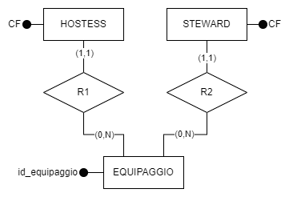
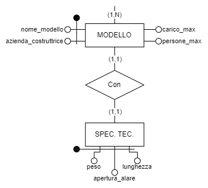

# Gruppo 29

## 1 Analisi dei requisiti

### 1.1 Sintesi del testo

[//]: # (Nel contesto della gestione delle informazioni relative ai voli in partenza da un piccolo aeroporto, il nostro obiettivo è modellare in modo completo e accurato le varie dinamiche connesse a questa attività. Ogni volo, programmato quotidianamente, presenta un insieme di caratteristiche cruciali, tra cui la destinazione desiderata e l'orario programmato di partenza.)

[//]: # (Immaginiamo una situazione in cui, pur mantenendo la regolarità dell'orario di volo giornaliero, alcune variabili possono variare da un giorno all'altro. Ad esempio, il cancello d'uscita &#40;gate&#41; e l'aeromobile possono essere soggetti a cambiamenti. Inoltre, ogni volo comporta la presenza di un equipaggio, composto da due piloti e almeno una hostess o uno steward, tutti obbligatoriamente presenti per garantire il corretto svolgimento dell'operazione.)

[//]: # (Una caratteristica importante del nostro sistema è la fissità di un singolo volo per ciascun aeroplano in ogni giornata. Ogni giorno, desideriamo acquisire informazioni dettagliate sull'orario di partenza e sulla destinazione di ogni singolo aeromobile in servizio. Abbiamo assunto che, considerando giorno, ora e gate come parametri fissi, si possa identificare univocamente ciascun volo, associandolo in modo inequivocabile all'aeromobile coinvolto e alla sua destinazione.)

[//]: # (Per garantire una gestione efficiente delle informazioni, ogni aeromobile, identificato da un codice specifico, sarà caratterizzato da dettagli riguardanti l'azienda costruttrice e il modello. Questi dettagli includono elementi chiave come la capacità massima di passeggeri, la quantità massima di materiale trasportabile e specifiche tecniche quali peso, lunghezza e apertura alare.)

[//]: # (Al fine di visualizzare chiaramente questa complessa rete di informazioni, intendiamo sviluppare uno schema Entità-Relazioni completo. Tale schema sarà arricchito con attributi significativi per ciascuna entità, evidenziando le chiavi di identificazione, e definirà relazioni interconnesse con precisi vincoli di cardinalità e partecipazione. Inoltre, prevederemo regole aziendali, inclusi vincoli di integrità e regole di derivazione, per garantire la coerenza e la correttezza delle informazioni gestite nel sistema.)

Si vuole realizzare una basi di dati per un piccolo aeroporto, del quale vogliamo rappresentare i dati relativi ai voli, all’equipaggio e agli aeromobili che effettuano i voli. 
Di ogni volo specifichiamo la destinazione e l’orario di partenza. Assumiamo inoltre, che ogni volo venga svolto ogni giorno della settimana, sempre nello stesso orario, ma che da un giorno all’altro possano cambiare il cancello d’uscita (gate) e l’aeromobile utilizzato. Ogni volo ha orario di partenza e gate unici (cioè, che nessun altro volo può partire allo stesso orario sullo stesso gate e viceversa) e viene effettuato da un equipaggio specifico. 
Ogni equipaggio è formato da due piloti, zero, una o più hostess, zero, uno o più steward. I due piloti e almeno una hostess o uno steward devono essere sempre presenti. Identifichiamo gli equipaggi mediante idonei codici identificativi. Per hostess e steward rappresentiamo il codice fiscale, e per i piloti, l’età e il codice fiscale. 
Di ogni aeromobile utilizzato, identificato da un opportuno codice, memorizziamo l’azienda costruttrice e il modello, con le sue caratteristiche tecniche: la capacità (numero massimo di passeggeri e quantità massima di materiale trasportabile) e le caratteristiche tecniche (peso, lunghezza e apertura alare). Ogni aeromobile effettua un unico volo al giorno.

### 1.2 Glossario
| Termine             | Descrizione                                             | Sinonimi |          Collegamenti           |
|:--------------------|:--------------------------------------------------------|:--------:|:-------------------------------:|
| Volo                | Volo in partenza dall'aeroporto                         |    ~     |     Aeromobile, Equipaggio      |
| Aeromobile          | Aereo che effettua un volo                              |   Aero   |          Volo, Modello          |
| Modello             | Modello di un aeromobile                                |    ~     | Aeromobile, Specifiche tecniche |
| Specifiche tecniche | Peso, apertura alare e lunghezza relative ad un modello |    ~     |             Modello             |
| Equipaggio          | Insieme di persone che gestiscono un volo               |    ~     |    Volo, Pilota, Assistente     |
| Pilota              | Persona che pilota un aereo e fa parte di un equipaggio |    ~     |           Equipaggio            |
| Assistente          | Persona che assiste i passeggeri di un volo             |    ~     |  Equipaggio, Hostess, Steward   |
| Hostess             | Assistente di sesso femminile                           |    ~     |           Assistente            |
| Steward             | Assistente di sesso maschile                            |    ~     |           Assistente            |

### 1.3 Scopo

Si vuole realizzare una basi di dati per un piccolo aeroporto, del quale vogliamo rappresentare i dati relativi
ai voli, all’equipaggio e agli aeromobili che effettuano i voli.

### 1.4 Specifiche per entità

#### FRASI RELATIVE AI VOLI:

Di ogni volo specifichiamo la destinazione e l’orario di partenza. Assumiamo inoltre, che ogni volo venga
svolto ogni giorno della settimana, sempre nello stesso orario, ma che da un giorno all’altro possano
cambiare il cancello d’uscita (gate) e l’aeromobile utilizzato. Ogni volo ha orario di partenza e gate unici
(cioè, che nessun altro volo può partire allo stesso orario sullo stesso gate e viceversa) e viene effettuato da
un equipaggio specifico.

#### FRASI RELATIVE AGLI EQUIPAGGI:

Ogni equipaggio è formato da due piloti, zero, una o più hostess, zero, uno o più steward. I due piloti e almeno una hostess o uno steward devono essere sempre presenti. Identifichiamo gli equipaggi mediante idonei codici identificativi. Per hostess e steward rappresentiamo il codice fiscale, e per i piloti, l’età e il codice fiscale.

#### FRASI RELATIVE AGLI AEROMOBILI:

Di ogni aeromobile utilizzato, identificato da un opportuno codice, memorizziamo l’azienda costruttrice e il modello, con le sue caratteristiche tecniche: la capacità (numero massimo di passeggeri e quantità massima di materiale trasportabile) e le caratteristiche tecniche (peso, lunghezza e apertura alare). Ogni aeromobile effettua un unico volo al giorno.

## 2 Progettazione concettuale

### 2.1 Schema Entità-Relazioni

#### Prima proposta

La proposta iniziale del nostro schema Entità Relazione (ER) prevedeva la suddivisione delle caratteristiche dell'aeromobile in tre entità separate, con l'obiettivo di conferire al modello una maggiore modularità. Tuttavia, abbiamo rapidamente constatato che questa approccio comportava un'eccessiva complessità dello schema, spingendoci a riconsiderare la progettazione.

Di conseguenza, abbiamo deciso di semplificare lo schema, eliminando la suddivisione delle caratteristiche dell'aeromobile in entità distinte. Invece, abbiamo scelto di collegare direttamente le entità "Azienda Costruttrice" e "Carico" all'entità "Aeromobile" come attributi. Questa decisione è stata presa al fine di razionalizzare la struttura complessiva dello schema, riducendo la complessità e facilitando la comprensione del modello dati.

#### Schema concettuale finale

#### Vincoli d'integrità

##### RV1 **Equipaggio non eccede persone_max**
In ogni il numero di persone che compone l'equipaggio deve essere minore o uguale al numero massimo di persone trasportabili dall'aereomobile.

##### RV2 **Cardinalità hostess-steward**
L'entità "EQUIPAGGIO" deve avere almeno uno fra hostess e steward.

#### Dizionario dei dati

|   Entità   | Descrizione                                            |                                        Attributi                                        |      Identificatore       |
|:----------:|:-------------------------------------------------------|:---------------------------------------------------------------------------------------:|:-------------------------:|
|    Volo    | Volo che parte ogni giorno alla stessa ora             |                     ora, destinazione, gate, _capacità\_passeggeri_                     |         gate, ora         |
| Aeromobile | Aeromobile coinvolto nel volo                          |                                      id_assistente                                      |       id_assistente       |
|  Modello   | Modello specifico dell'aeromobile                      | name, azienda, carico_max, persone_max, spec_tecniche (peso, lunghezza, apertura_alare) |nome, azienda_costruttrice |
| Equipaggio | Equipaggio che imbarca l'aeromobile                    |                                      id_equipaggio                                      |       id_equipaggio       |
|   Pilota   | Piloti che pilotano l'aeromobile                       |                                        id_pilota                                        |         id_pilota         |
| Assistente | Assistente (steward e/o hostess) che assistono il volo |                                      id_assistente                                      |       id_assistente       |
|  Steward   | Assistente maschile                                    |                                            ~                                            |             ~             |
|  Hostess   | Assistente femminile                                   |                                            ~                                            |             ~             |

#### Tabella di cardinalità delle relazioni 

|     E1     | Cardinalità |  Relazione  | Cardinalità |     E2     |
|:----------:|:-----------:|:-----------:|:-----------:|:----------:|
|    Volo    |    (1,1)    | **Imbarca** |    (1,1)    | Equipaggio |
| Aeromobile |    (1,1)    | **Tratta**  |    (1,1)    |    Volo    |
| Aeromobile |    (1,1)    |   **Di**    |    (1,n)    |  Modello   |
|   Pilota   |    (1,1)    | **Comanda** |    (2,2)    | Equipaggio |
| Assistente |    (1,1)    | **Compone** |    (1,n)    | Equipaggio |

#### Regole di derivazione

##### RD1 **capacità passeggeri**
L'attributo descrive la capacità massima di passeggeri imbarcabili da un aeromobile.

Di un volo, si ricerca il modello dell'aeromobile, e _capacità passeggeri_ viene derivato in base all'attributo _persone_max_ di MODELLO meno numero di persone nell'equipaggio.

**capacità_passeggeri** = **MODELLO**(_persone_max_)- |nr. assistenti|

### 2.2 Operazioni

1. **cambio_gate**
    - Dato un volo sostituisce il numero del gate corrente con uno aggiornato

2. **cambio_aeromobile**
    - Dato un volo sostituisce l'aeromobile assegnata alla tratta con un nuovo aeromobile

3. **ricerca_voli_gate**
    - Dato un gate restituisce l'elenco dei voli programmati in giornata

4. **ricerca_voli_destinazione**
    - Data una destinazione restituisce l'elenco dei voli che partono in giornata e la raggiungono

5. **ricerca_voli_odierni**
    - Restituisce l'elenco dei voli in partenza in giornata

6. **elimina_volo**
    - Dato un volo, lo elimina per sempre

7. **Inserisci_volo**
    - Inserisce un volo nel database

**Operazioni complesse**

8. **Steward_Aerei_Pesanti**
    - Il numero di steward che lavorano su voli che fanno tratte con aerei con peso almeno X e al massimo Y

9. **Aerei_Di_Linea**
    - Gli aerei con "_persone_max_" minimo comandati da piloti con età compresa fra 30 e 60 inclusi

10. **Piloti_Cargo**
    - I piloti che comandano aerei con "carico_max" superiore a X e con un numero di assistenti inferiore a Y

### 2.3 Tabella dei volumi

|  Concetto   |   Tipo    | Volume |
|:-----------:|:---------:|:------:|
| Aeromobile  |  Entità   |   20   |
| Assistente  |  Entità   |   80   |
| Equipaggio  |  Entità   |   20   |
|   Modello   |  Entità   |   10   |
|   Pilota    |  Entità   |   40   |
|    Volo     |  Entità   |   20   |
|   Comanda   | Relazione |   40   |
|   Compone   | Relazione |   80   |
|     Di      | Relazione |   20   |
|   Imbarca   | Relazione |   20   |
|   Tratta    | Relazione |   20   |

### 2.4 Tabella delle frequenze

| Operazione                    | Frequenza (giornaliera) |
|:------------------------------|:-----------------------:|
| Cambio Gate                   |            2            |
| Cambio Aereo                  |            2            |
| Ricerca Voli(gate)            |          1000           |
| Ricerca Voli(Destinazione)    |          5000           | 
| Ricerca Voli Odierni          |          5000           | 
| Elimina Volo                  |            2            |
| Inserisci Volo                |            2            | 
| N° Steward Aerei Pesanti      |           10            |
| Aerei di Linea                |           10            |
| Piloti Cargo                  |           10            |

## 3 Progettazione logica

### 3.1 Analisi di ridondanza

Capacità_passeggeri è un attributo interessante da analizzare perché richiede la visita di gran parte dello schema

[//]: # (TODO: da aggiungere calcoli)
(**schema ?**)

[file docs](https://users.dimi.uniud.it/~luca.geatti/data/courses/2023/bdd-lab2023/atzeni_6e_slide_cap7.pptx)

### 3.2 Reificazione dello schema ER

In questa fase della relazione discuteremo di come abbiamo modificato lo schema concettuale proposto, reiterando le parti di schema che non possono essere tradotte direttamente nello schema relazionale.

#### Assistente dell'equipaggio

Nel contesto dello schema Entity-Relationship (ER), è emersa la necessità di trattare una specializzazione di "assistente" attraverso le entità HOSTESS e STEWARD. Tuttavia, la trasposizione diretta di questa specializzazione in uno schema relazionale non è praticabile. Pertanto, si è optato per una connessione diretta delle entità HOSTESS e STEWARD all'entità EQUIPAGGIO.

Tuttavia, questa scelta di modellazione comporta la perdita del vincolo precedentemente espresso dalla generalizzazione, il quale garantiva che ogni istanza di EQUIPAGGIO dovesse includere almeno un'istanza tra HOSTESS e STEWARD. Al fine di preservare tale vincolo nell'ambito dello schema relazionale, si è reso necessario introdurre un vincolo d'integrità esterno.

**Vincolo d'integrità esterno**: ogni istanza di EQUIPAGGIO dovesse includere almeno un'istanza tra HOSTESS e STEWARD

#### Modello di aeromobile

Per risolvere l'attributo composto denominato "specifiche tecniche", il quale raggruppava gli attributi "peso", "lunghezza" ed "apertura alare", si è deciso d'introdurre un'entità dedicata denominata "SPECIFICHE TECNICHE".

La creazione di tale entità permette di gestire in modo più flessibile e strutturato le informazioni relative alle specifiche tecniche.

Le due entità MODELLO e SPEC. TEC. sono in relazione one-to-many. Questa relazione è stata implementata per riflettere il fatto che un insieme di specifiche tecniche può essere associato a più modelli, mentre ciascun modello è collegato a un unico insieme di specifiche tecniche.

[//]: # (TODO:  Inserire schema ER dopo reiterazione per confrontare meglio i modelli)

### 3.3 Schema relazionale   

HOSTESS (<U>CF</U>)

STEWARD (<U>CF</U>)

R1 (<U>*CF*</U>, <U>*id_equipaggio*</U>)
- CF: FK $\rightarrow$ HOSTESS.CF

R2 (<U>*CF*</U>, <U>*id_equipaggio*</U>)
- CF: FK $\rightarrow$ STEWARD.CF

EQUIPAGGIO (<U>id_equipaggio</U>)

PILOTA (<U>CF</U>, età)

COMANDA (id_equipaggio, CF)
- id_equipaggio: FK $\rightarrow$ EQUIPAGGIO.id_equipaggio
- CF: FK $\rightarrow$ PILOTA.CF)

VOLO (<U>gate</U>, <U>ora</U>, destinazione, capacità_passeggeri)

IMBARCA (<U>*id_equipaggio*</U>, <U>*gate*</U>, <U>*ora*</U>)
- id_equipaggio: FK $\rightarrow$ EQUIPAGGIO.id_equipaggio
- gate: FK $\rightarrow$ VOLO.gate
- ora: FK $\rightarrow$ VOLO.ora

AEROMOBILE (<U>id_aereo</U>)

TRATTA (<U>*gate*</U>, <U>*ora*</U>, <U>*id_aereo*</U>)
- gate: FK $\rightarrow$ VOLO.gate
- ora: FK $\rightarrow$ VOLO.ora
- id_aereo: FK $\rightarrow$ AEROMOBILE.id_aereo

MODELLO (<U>nome_modello</U>, <U>azienda_costruttrice</U>, carico_max, persone_max)

DI (<U>*id_aereo*</U>, <U>*nome_modello*</U>, <U>*azienda_costruttrice*</U>)
- id_aereo: FK $\rightarrow$ AEROMOBILE.id_aereo
- nome_modello: FK $\rightarrow$ MODELLO.nome_modello
- azienda_costruttrice: FK $\rightarrow$ MODELLO.azienda_costruttrice

SPECIFICHE_TECNICHE (<U>peso</U>, <U>apertura_alare</U>, <U>lunghezza</U>)

CON (<U>*nome_modello*</U>, <U>*azienda_costruttrice*</U>, <U>*peso*</U>, <U>*apertura_alare*</U>, <U>*lunghezza*</U>)
- nome_modello: FK $\rightarrow$ MODELLO.nome_modello
- azienda_costruttrice: FK $\rightarrow$ MODELLO.azienda_costruttrice
- peso: FK $\rightarrow$ SPECIFICHE_TECNICHE.peso
- apertura_alare: FK $\rightarrow$ SPECIFICHE_TECNICHE.apertura_alare
- lunghezza: FK $\rightarrow$ SPECIFICHE_TECNICHE.lunghezza

### 3.4 Vincoli di dominio 

1. **VOLO**

|        Ora         |      Gate      | Destinazione |
|:------------------:|:--------------:|:------------:|
| [0, 60 $\cdot$ 24] | [1, max_gates] |      ~       |

2. **MODELLO**

| Nome_modello | Azienda_costruttrice | Persone_max | Carico_max | Peso  | Lunghezza | Apertura_alare |
|:------------:|:--------------------:|:-----------:|:----------:|:-----:|:---------:|:--------------:|
|      ~       |          ~           |   x >= 3    |   x > 0    | x > 0 |   x > 0   |     x > 0      |

# Domande
- Le operazioni che usiamo per l'analisi della ridondanza, vanno implementate o no? (file lezione1, slide 15)
- Come fare lo schema relazionale? (tabelle?)
- Nell'analisi di ridondanza le operazioni sono corrette
- Sinonimi nel glossario possono essere tolti?