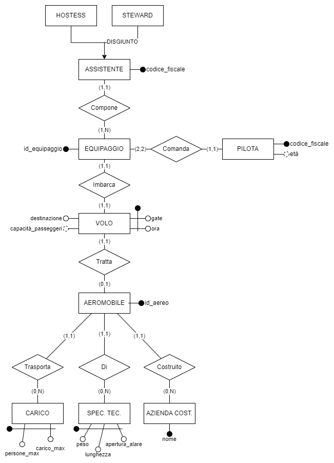
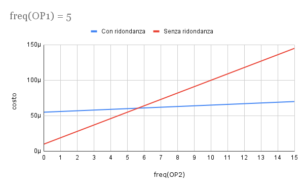
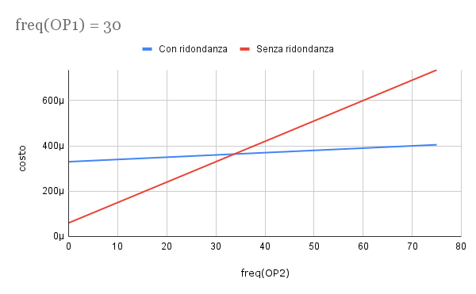
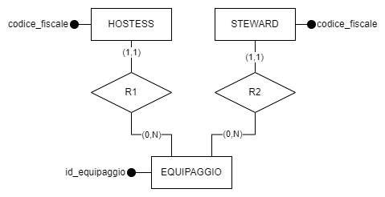
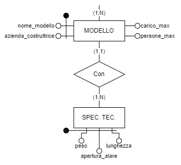
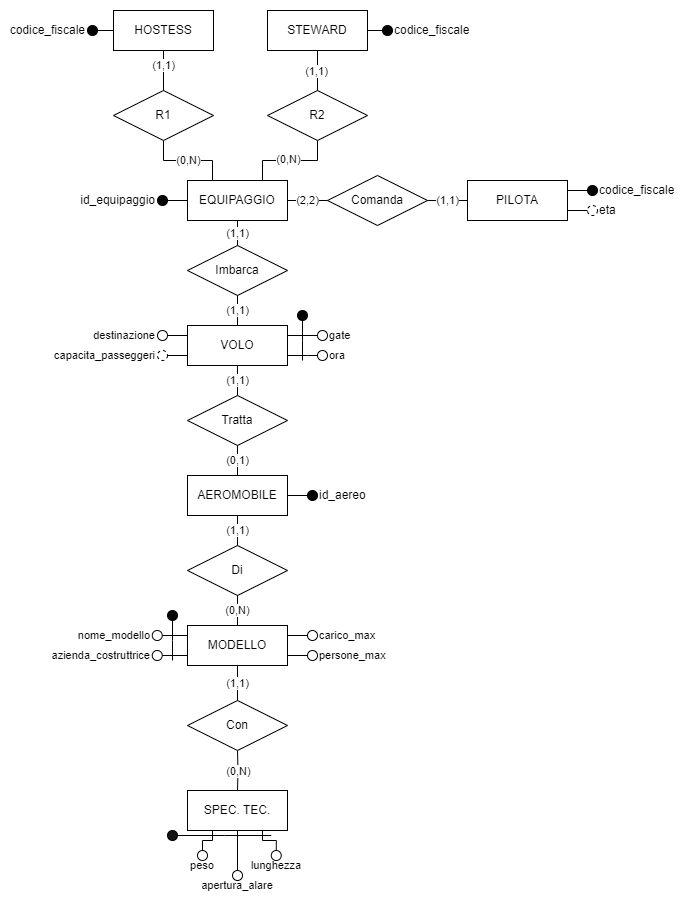
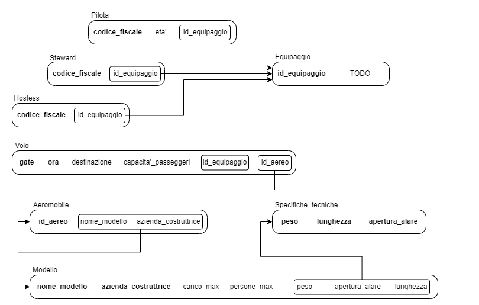
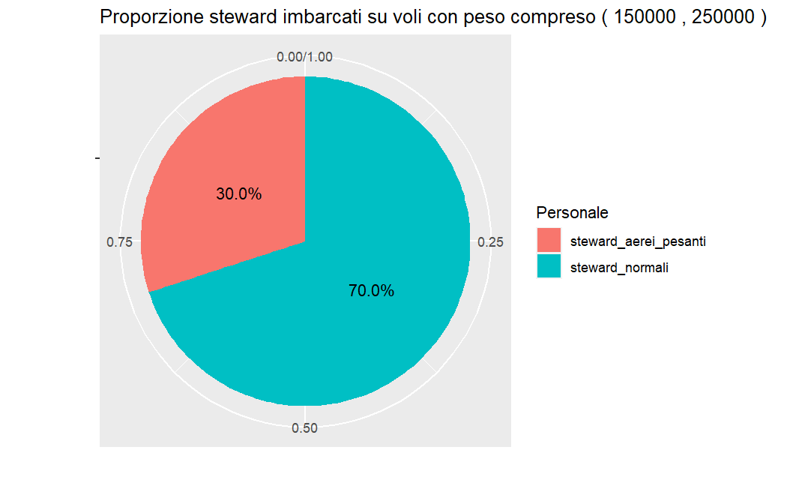

# `Gruppo 29`

# 1 Analisi dei requisiti

## 1.1 Sintesi del testo
Lo scopo del progetto è quello di realizzare una base di dati per gestire i voli in partenza da un piccolo aeroporto. 
Verranno rappresentate le informazioni relative ai voli, agli equipaggi e agli aerei. 

Assumendo che ogni volo venga svolto ogni giorno della settimana, sempre nello stesso orario, ma con cancello d’uscita (gate) e l’aeromobile possibilmente diversi di ogni volo specifichiamo la destinazione e l’orario di partenza. Ognuno di questi ha orario di partenza e gate unici (cioè, che nessun altro volo può partire allo stesso orario sullo stesso gate e viceversa) e viene effettuato da un equipaggio specifico.

Ogni equipaggio è formato da due piloti, zero, una o più hostess e zero, uno o più steward. Devono quindi essere sempre presenti due piloti e almeno una hostess o uno steward. Gli equipaggi sono identificati tramite un codice univoco, mentre per hostess, steward e piloti viene memorizzato il codice fiscale.

Ogni aeromobile viene identificato da un opportuno codice e si conosce sia l’azienda costruttrice che il modello con le sue caratteristiche tecniche quali: capacità (numero massimo di passeggeri e quantità massima di materiale trasportabile) e le caratteristiche del velivolo (peso, lunghezza e apertura alare). 

Ogni aeromobile effettua un unico volo al giorno.

## 1.2 Glossario
| Termine              | Descrizione                                             | Sinonimi |          Collegamenti           |
|:---------------------|:--------------------------------------------------------|:--------:|:-------------------------------:|
| Volo                 | Volo in partenza dall'aeroporto                         |    ~     |     Aeromobile, Equipaggio      |
| Aeromobile           | Aereo che effettua un volo                              |  Aereo   |          Volo, Modello          |
| Modello              | Modello di un aeromobile                                |    ~     | Aeromobile, Specifiche tecniche |
| Specifiche tecniche  | Peso, apertura alare e lunghezza relative ad un modello |    ~     |             Modello             |
| Equipaggio           | Insieme di persone che gestiscono un volo               |    ~     |    Volo, Pilota, Assistente     |
| Pilota               | Persona che pilota un aereo e fa parte di un equipaggio |    ~     |           Equipaggio            |
| Assistente           | Persona che assiste i passeggeri di un volo             |    ~     |  Equipaggio, Hostess, Steward   |
| Hostess              | Assistente di sesso femminile                           |    ~     |           Assistente            |
| Steward              | Assistente di sesso maschile                            |    ~     |           Assistente            |
| Gate                 | Cancello d'imbarco                                      |    ~     |              Volo               |
| Azienda_costruttrice | Azienda che costruisce modelli di aeromobili            |    ~     |             Modello             |


## 1.3 Specifiche sui dati
|                                                                           Frasi di carattere generale                                                                            |
|:--------------------------------------------------------------------------------------------------------------------------------------------------------------------------------:|
| Si vuole realizzare una basi di dati per un piccolo aeroporto, del quale vogliamo rappresentare i dati relativi ai voli, all’equipaggio e agli aeromobili che effettuano i voli. |

|                                                                                                                                                                                                                        Frasi relative ai voli                                                                                                                                                                                                                         |
|:---------------------------------------------------------------------------------------------------------------------------------------------------------------------------------------------------------------------------------------------------------------------------------------------------------------------------------------------------------------------------------------------------------------------------------------------------------------------:|
| Di ogni volo specifichiamo la destinazione e l’orario di partenza. Assumiamo inoltre, che ogni volo venga svolto ogni giorno della settimana, sempre nello stesso orario, ma che da un giorno all’altro possano cambiare il cancello d’uscita (gate) e l’aeromobile utilizzato. Ogni volo ha orario di partenza e gate unici(cioè, che nessun altro volo può partire allo stesso orario sullo stesso gate e viceversa) e viene effettuato da un equipaggio specifico. |

|                                                                                                                                                          Frasi relative agli equipaggi                                                                                                                                                           |
|:------------------------------------------------------------------------------------------------------------------------------------------------------------------------------------------------------------------------------------------------------------------------------------------------------------------------------------------------:|
| Ogni equipaggio è formato da due piloti, zero, una o più hostess, zero, uno o più steward. I due piloti e almeno una hostess o uno steward devono essere sempre presenti. Identifichiamo gli equipaggi mediante idonei codici identificativi. Per hostess e steward rappresentiamo il codice fiscale, e per i piloti, l’età e il codice fiscale. |

|                                                                                                                                                                     Frasi relative agli aeromobili                                                                                                                                                                      |
|:-----------------------------------------------------------------------------------------------------------------------------------------------------------------------------------------------------------------------------------------------------------------------------------------------------------------------------------------------------------------------:|
| Di ogni aeromobile utilizzato, identificato da un opportuno codice, memorizziamo l’azienda costruttrice e il modello, con le sue caratteristiche tecniche: la capacità (numero massimo di passeggeri e quantità massima di materiale trasportabile) e le caratteristiche tecniche (peso, lunghezza e apertura alare). Ogni aeromobile effettua un unico volo al giorno. |


## 1.4 Specifiche sulle operazioni

Le principali operazioni messe a disposizione dalla base di dati con una stima plausibile di quante volte possono venire invocate in media

_**Operazioni base**_

1. **cambio_gate**
    - Dato un volo sostituisce il numero del gate corrente con uno aggiornato (2 volte al giorno)

2. **cambio_aeromobile**
    - Dato un volo sostituisce l'aeromobile assegnata alla tratta con un nuovo aeromobile (2 volte al giorno)

3. **ricerca_voli_gate**
    - Dato un gate restituisce l'elenco dei voli programmati in giornata (circe 1000 volte al giorno)

4. **ricerca_voli_destinazione**
    - Data una destinazione restituisce l'elenco dei voli che partono in giornata e la raggiungono (circa 5000 volte al giorno)

5. **ricerca_voli_odierni**
    - Restituisce l'elenco dei voli in partenza in giornata (5000 volte al giorno) 

6. **elimina_volo**
    - Dato un volo, lo elimina per sempre (2 volte al giorno)

7. **inserisci_volo**
    - Inserisce un volo nel database (2 volte al giorno)

_**Operazioni complesse**_

1. **Steward_Aerei_Pesanti**
    - Il numero di steward che lavorano su voli che fanno tratte con aerei con peso almeno X e al massimo Y (operazione svolta 10 volte al giorno)

2. **Aerei_Li_Linea**
    - Gli aerei con attributo _persone_max_ minimo e comandati da piloti con età compresa fra 30 e 60 inclusi (10 volte al giorno)

3. **Piloti_Cargo**
    - I piloti che comandano aerei con "carico_max" superiore a X e con un numero di assistenti inferiore a Y (10 volte al giorno)


# 2 Progettazione concettuale


## 2.1 Schema Entità-Relazioni

La creazione dello schema _Entità-relazioni_ ha seguito un approccio _bottom-up_. Per ogni _entità_ si sono prima decisi gli attributi principali e poi i collegamenti alle altre _entità_ tramite _relazioni_ fino ad arrivare ad un prototipo di schema funzionante. 

Questo prototipo è stato rivisto e ottimizzato per migliorare la coerenza logica rispetto al caso d'uso.

### 2.1.1 Prima revisione


La proposta iniziale del nostro schema _ER_ prevedeva la suddivisione delle caratteristiche dell'aeromobile in tre entità separate. Questa soluzione era stat adottata con l'obbiettivo di conferire al modello una maggiore modularità.

Tuttavia questo approccio comportava un'eccessiva complessità dello schema, per cui abbiamo deciso di scartare questa proposta.

### 2.1.2 Schema ER 


La suddivisione delle caratteristiche dell'aeromobile in entità distinte è stata eliminata a favore di un'entità _MODELLO_ con attributi _nome\_modello_,  _casa\_costruttrice_, _carico\_max_ e  _persone\_max_. Le informazioni relative a _peso_, _lunghezza_ e _apertura\_alare_ sono state inglobate nell'attributo composto _specifiche\_tecniche_.

Nello schema sono presenti gli attributi disgiunti _HOSTESS_ e _STEWARD_ collegati ad _ASSISTENTE_.  Questa separazione permette di distinguere tra assistenti di genere femminile e maschile all'interno del sistema.

Per garantire che ad ogni equipaggio siano assegnati esattamente 2 piloti è presente la cardinalità $(2,2)$ fra:

$$
EQUIPAGGIO \xrightarrow{(2,2)}  comanda \xrightarrow{(1,1)} PILOTA
$$

All'interno di _PILOTA_ è presente un attributo derivato _eta_ che è calcolabile in base al codice fiscale contenuto nell'attributo _codice\_fiscale_.

Anche in _VOLO_ è presente un attributo derivato, si tratta di _capacita\_passeggeri_ che è calcolabile tramite la formula:

$$
capacita\_passeggeri= persone\_max - (|EQUIPAGGIO| + |PILOTI|)
$$

in cui:

- $persone\_max$: numero massimo di persone trasportabili dal modello (_MODELLO.persone\_max_)
- $|EQUIPAGGIO|$: cardinalità di persone imbarcate come equipaggio dell'aereo
- $|PILOTI|$: cardinalità dei piloti, in questo caso sempre 2

Per dar maggiore flessibilità alla base di dati, è stata presa la decisione di consentire la presenza di aerei non correlati a voli, modelli non associati ad alcun aereo e specifiche non collegate a modelli. Questa scelta si rivela impossibile per l'equipaggio e il personale associato, in quanto non avrebbe senso la loro esistenza senza essere correlati a un volo.

### 2.1.3 Tabella di cardinalità delle relazioni

$$ 
VOLO \xrightarrow{(1,1)} imbarca \xrightarrow{(1,1)} EQUIPAGGIO 
$$

$$ 
AEROMOBILE \xrightarrow{(0,1)} tratta \xrightarrow{(1,1)} VOLO 
$$

$$ 
AEROMOBILE \xrightarrow{(1,1)} di \xrightarrow{(0,n)} MODELLO 
$$

$$ 
PILOTA \xrightarrow{(1,1)} comanda \xrightarrow{(2,2)} EQUIPAGGIO 
$$

$$ 
ASSISTENTE \xrightarrow{(1,1)} compone \xrightarrow{(1,n)} EQUIPAGGIO 
$$

## 2.2 Documentazione schema E-R

### 2.2.1 Dizionario dei dati
|   Entità   | Descrizione                                            |                                                  Attributi                                                  |           Identificatore           |
|:----------:|:-------------------------------------------------------|:-----------------------------------------------------------------------------------------------------------:|:----------------------------------:|
|    Volo    | Volo che parte ogni giorno alla stessa ora             |                               gate, ora, destinazione, _capacita\_passeggeri_                               |             gate, ora              |
| Aeromobile | Aeromobile coinvolto nel volo                          |                                                  id_aereo                                                   |              id_aereo              |
|  Modello   | Modello specifico dell'aeromobile                      | nome_modello, azienda_costruttrice, carico_max, persone_max, spec_tecniche(peso, lunghezza, apertura_alare) | nome_modello, azienda_costruttrice |
| Equipaggio | Equipaggio che imbarca l'aeromobile                    |                                                id_equipaggio                                                |           id_equipaggio            |
|   Pilota   | Piloti che pilotano l'aeromobile                       |                                             codice_fiscale, eta                                             |           codice_fiscale           |
| Assistente | Assistente (steward e/o hostess) che assistono il volo |                                               codice_fiscale                                                |           codice_fiscale           |
|  Steward   | Assistente maschile                                    |                                                      ~                                                      |                 ~                  |
|  Hostess   | Assistente femminile                                   |                                                      ~                                                      |                 ~                  |


### 2.2.2 Regole di vincolo
                                                                                                       
**(RV1)**: L'entità "EQUIPAGGIO" deve sempre includere almeno uno fra hostess e steward e sempre 2 piloti

### 2.2.3 Regole di derivazione


**(RD1)**: L'attributo "capacita_passeggeri" in "VOLO" descrive la capacità massima di passeggeri imbarcabili da un aeromobile.

- Per derivare la capacità passeggeri di un volo, si ricerca il modello dell'aeromobile, da cui si ottiene il numero massimo di persone che quell'aeromobile puo' trasportare usando l'attributo "persone_max". A questo valore viene sottratto il numero di persone presenti nell'equipaggio.

**(RD2)**: L'attributo "eta" in "PILOTA" indica l'età del pilota.

- Si ricava dal codice fiscale del pilota, estrapolando il settimo e ottavo carattere (che rappresentano le ultime due cifre dell'anno di nascita), l'ottavo carattere (che rappresenta il mese) e infine decimo e undicesimo carattere (che rappresentano il giorno di nascita). L'ottavo carattere rappresenta il mese di nascita secondo la tabella di conversione dell'agenzia delle entrate - A, B, C, D, E, H designano i primi 6 mesi dell'anno e L, M, P, R, S, T gli ultimi 6 mesi dell'anno.

# 3 Progettazione logica

## 3.1 Operazioni

_**Operazioni base**_

1. **cambio_gate**: Dato un volo sostituisce il numero del gate corrente con uno aggiornato.
2. **cambio_aeromobile**: Dato un volo sostituisce l'aeromobile assegnata alla tratta con un nuovo aeromobile.
3. **ricerca_voli_gate**: Dato un gate restituisce l'elenco dei voli programmati in giornata.
4. **ricerca_voli_destinazione**: Data una destinazione restituisce l'elenco dei voli che la raggiungono partendo in giornata.
5. **ricerca_voli_odierni**: Restituisce l'elenco dei voli in partenza in giornata.
6. **elimina_volo**: Dato un volo, lo elimina.
7. **inserisci_volo**: Inserisce un volo nel database. 

_**Operazioni complesse**_

1. **Steward_Aerei_Pesanti**: Il numero di steward che lavorano su voli che fanno tratte con aerei con peso almeno X e al massimo Y.
2. **Aerei_Di_Linea**: Gli aerei con "_persone_max_" minimo comandati da piloti con età compresa fra 30 e 60 inclusi.
3. **Piloti_Cargo**: I piloti che comandano aerei con "carico_max" superiore a X e con un numero di assistenti inferiore a Y.

## 3.2 Ristrutturazione dello schema ER

### 3.2.1 Tabella dei volumi

|  Concetto  |   Tipo    | Volume |
|:----------:|:---------:|:------:|
| Aeromobile |  Entità   |   20   |
| Assistente |  Entità   |   80   |
| Equipaggio |  Entità   |   20   |
|  Modello   |  Entità   |   10   |
|   Pilota   |  Entità   |   40   |
|    Volo    |  Entità   |   20   |
|  Comanda   | Relazione |   40   |
|  Compone   | Relazione |   80   |
|     Di     | Relazione |   20   |
|  Imbarca   | Relazione |   20   |
|   Tratta   | Relazione |   20   |


### 3.2.2 Tabella delle frequenze
| Operazione                 | Tipo        | Frequenza (giornaliera) |
|:---------------------------|-------------|:-----------------------:|
| Cambio Gate                | Interattiva |            2            |
| Cambio Aereo               | Interattiva |            2            |
| Ricerca Voli(gate)         | Interattiva |          1000           |
| Ricerca Voli(Destinazione) | Interattiva |          5000           |
| Ricerca Voli Odierni       | Interattiva |          5000           |
| Elimina Volo               | Interattiva |            2            |
| Inserisci Volo             | Interattiva |            2            |
| N° Steward Aerei Pesanti   | Interattiva |           10            |
| Aerei di Linea             | Interattiva |           10            |
| Piloti Cargo               | Interattiva |           10            |

### 3.2.3 Analisi di ridondanza

Osservando lo schema della base di dati si nota come l'attributo "capacita_passeggeri" associato all'entità "VOLO", possa essere derivabile. Per valutare se convenga o meno mantenere la ridondanza del dato, è stata condotta un'analisi di ridondanza.

#### Scenari

**Attributo derivato mantenuto**: il calcolo della capacità passeggeri avviene solo quando viene inserito un nuovo volo nella base di dati. In questo modo ogni successiva richiesta dell'attributo _capacità passeggeri_ verrà eseguita in tempo costante con una singola lettura.

**Senza attributo derivato**: l'inserimento dei voli è rapido e avviene immediatamente, tuttavia l'attributo capacita_passeggeri dovrà essere ricalcolato ogni volta.

#### Operazioni
Le due operazioni prese in esame:

**Operazione 1 (OP1)**: Inserimento di un nuovo volo nella base di dati.
**Operazione 2 (OP2)**: Richiesta del numero di passeggeri che possono imbarcarsi su un dato volo.

#### Volumi
Durante il calcolo, è essenziale considerare anche il numero medio di assistenti per ogni volo. 

Consultando la tabella dei volumi, si ricava che vengono svolti 20 voli in una giornata e che gli assistenti nella base di dati sono 80. Si può quindi ipotizzare una media di 4 assistenti per volo.

$n= \frac{assistenti}{voli}= \frac{80}{20}=4$

Ulteriori dati relativi ai volumi utilizzati nei calcoli sono registrati nella tabelle apposite: [tabella dei volumi](#321-tabella-dei-volumi) e [tabella delle frequenze](#322-tabella-delle-frequenze)

#### Frequenze
Il numero delle frequenze giornaliere con le quali vengono svolte le operazioni deve anch'esso essere ragionevole. In questo caso, si è ipotizzato l'inserimento di 5 voli al giorno e la richiesta del numero di passeggeri per ogni volo, 50 volte al giorno.

- $freq(OP1)=5$ (vengono inseriti 5 voli al giorno)
- $freq(OP2)=50$  (vengono fatte 50 richieste al giorno)

#### Costi di lettura e scrittura
Supponendo che la lettura della nostra base di dati implichi una spesa pari alla metà di quella necessaria per una scrittura, i costi relativi sono:

- $(read) 1R=1\mu$
- $(write) 1W =2\mu$

#### Analisi dei costi

##### Tavola degli accessi in presenza di ridondanza

_OP1_

| Concetto   | Costrutto | Accessi | Tipo |
|------------|:---------:|:-------:|:----:|
| Volo       |     E     |    1    |  W   |
| Aeromobile |     E     |    1    |  R   |
| Modello    |     E     |    1    |  R   |
| Equipaggio |     E     |    1    |  R   |
| Assistente |     E     |    4    |  R   |

_OP2_

| Concetto | Costrutto | Accessi | Tipo |
|----------|:---------:|:-------:|:----:|
| Volo     |     E     |    1    |  R   |

##### Tavola degli accessi in assenza di ridondanza

_OP1_

| Concetto | Costrutto | Accessi | Tipo |
|----------|:---------:|:-------:|:----:|
| Volo     |     E     |    1    |  W   |


_OP2_

| Concetto   | Costrutto | Accessi | Tipo |
|------------|:---------:|:-------:|:----:|
| Volo       |     E     |    1    |  R   |
| Aeromobile |     E     |    1    |  R   |
| Modello    |     E     |    1    |  R   |
| Equipaggio |     E     |    1    |  R   |
| Assistente |     E     |    4    |  R   |

##### Costo operazioni con ridondanza
Nel contesto dello scenario che prevede l'utilizzo dell'attributo derivato, il costo per le due operazioni è così definito:

$$
\begin{cases}
cost(OP1CR)&=1W+2R+1R+nR \\
cost(OP2CR)&=1R
\end{cases}
$$

L'operazione $OP1_{CR}$ (con ridondanza) ha un costo iniziale di 1W, derivante dalla scrittura di un nuovo volo nell'entità "VOLO". Successivamente, l'operazione effettua due letture per ottenere la capacità massima di persone del modello di aeromobile associato a quel volo. Queste letture coinvolgono prima l'entità "AEROMOBILE" e successivamente l'entità "MODELLO". Infine, l'operazione determina il numero del personale che compone l'equipaggio leggendo l'entità "EQUIPAGGIO" e gli $n$ assistenti associati a tale equipaggio. Essendo l'equipaggio composto esattamente da due piloti, si evitano così ulteriori letture per questa categoria di personale..

L'operazione $OP2_{CR}$ ha un costo molto basso poiché legge direttamente l'attributo derivato presente nell'entità "VOLI".

Il costo totale nel caso in cui è mantenuta la ridondanza risulta quindi:

$$
\begin{aligned}
TOT_1 &=freq(OP1) \cdot cost(OP1_{CR}) + freq(OP2) \cdot cost(OP2_{CR}) \\
&=5 \cdot (1W+3R+nR) + 50 \cdot (1R) \\
&=5 \cdot (2\mu + 3\mu + 4\mu) + 50 \cdot (1\mu) \\
&=10\mu + 15\mu + 20\mu + 50\mu \\
&=95\mu \\
\end{aligned}
$$

##### Costo operazioni senza ridondanza
Nel contesto dello scenario in cui non si fa uso dell'attributo derivato, il costo per le due operazioni è il seguente:

$$
\begin{cases}
cost(OP1SR)=1W \\
cost(OP2SR)=1R+2R+1R+nR
\end{cases}
$$

In questo caso, si nota che $OP1_{SR}$ (senza ridondanza) ha un costo di 1W, dovuto alla scrittura del volo nell'entità "VOLO".

L'operazione $OP2_{SR}$, al contrario, deve contare il numero del personale che compone l'equipaggio, seguendo lo stesso processo descritto nel caso con ridondanza.

Il costo totale nel caso in cui viene eliminata la ridondanza risulta quindi:

$$
\begin{aligned}
TOT_2 &=freq(OP1) \cdot cost(OP1_{SR}) + freq(OP2) \cdot cost(OP2_{SR})\\
&=5 \cdot (1W) + 50 \cdot (1R+2R+1R+nR) \\
&=5 \cdot (2\mu) + 50 \cdot (4\mu + 4\mu) \\
&=10\mu + 200\mu + 200\mu \\
&=410\mu\\
\end{aligned}
$$

#### Conclusione dell'analisi di ridondanza
Dai calcoli effettuati, possiamo dedurre che in una giornata in cui vengono rispettate le frequenze assegnate, ovvero $freq(OP1)=5$ e $freq(OP2)=50$, risulta vantaggioso utilizzare l'approccio con ridondanza, in quanto abbatte il costo a circa un quarto del tempo utilizzato altrimenti.
Mantenere il dato comporta un costo finale di $95\mu$ (vedi $EQ.1$), mentre ricavarlo ogni volta costa $410 \mu$ (vedi $EQ.2$).

#### Grafici

Grazie ad un grafico è possibile esaminare quando conviene adottare un approccio rispetto all'altro. 

Considerando che la funzione che determina il costo complessivo delle operazioni dipende da due parametri, $freq(OP1)$ e $freq(OP2)$, abbiamo optato per fissare il valore della frequenza per la prima operazione, variando invece la frequenza della seconda. Questa scelta è motivata dal fatto che riteniamo la frequenza della seconda operazione (richiesta del numero di passeggeri che possono imbarcarsi in una giornata) più variabile rispetto alla prima (inserimento di un volo).



Dal grafico, è evidente che eliminare la ridondanza è conveniente solo quando la frequenza dell'operazione $OP2$ (richieste sulla capacità passeggeri di un volo) non supera le cinque occorrenze. Al di là di questo punto, diventa chiaro che il costo aumenta notevolmente, con un'incidenza molto maggiore rispetto all'approccio con ridondanza. Quest'ultimo mostra una tendenza quasi costante o, comunque, con un coefficiente angolare molto basso.

Abbiamo osservato, inoltre, che il punto d'intersezione delle due rette si verifica sempre in prossimità del valore sull'asse delle ascisse che scegliamo d'impostare per la frequenza della prima operazione. Da ciò, possiamo generalizzare affermando che l'approccio con ridondanza risulta preferibile ogni volta che la frequenza delle richieste della capacità passeggeri supera quella degli inserimenti.



In questo secondo grafico, è possibile osservare lo spostamento del punto d'intersezione quando aumentiamo il valore della frequenza della prima operazione a $freq(OP1)=30$. 

Si nota che quanto appena affermato rimane valido poiché il punto d'intersezione si sposta approssimativamente a $30$ sull'asse delle ascisse. Facciamo notare inoltre che maggiore è il valore scelto per $freq(OP1)$, minore è il grado di correttezza di questa affermazione. Tuttavia, possiamo affermare che all'interno del nostro dominio di interesse, questa affermazione è veritiera.

#### Riflessioni finali
In base ai calcoli condotti durante l'analisi di ridondanza e considerando la tabella delle frequenze che abbiamo ritenuto appropriata, possiamo affermare che, per questa specifica base di dati, è vantaggioso mantenere la ridondanza attraverso l'utilizzo dell'attributo derivato.

Tuttavia, è fondamentale tenere presente che la soluzione con ridondanza comporta un aumento dello spazio di archiviazione, in quanto si aggiunge una colonna alla tabella dell'entità "VOLO". In situazioni in cui l'aeroporto gestisce un elevato numero di voli giornalieri, questo aspetto potrebbe non essere trascurabile e richiederebbe un'analisi ulteriore per valutare gli impatti sulla gestione dello spazio di archiviazione.

### 3.2.4 Ristrutturazione

La fase di ristrutturazione permette di adattare lo schema ER formalizzando costrutti che non possono essere tradotti nello schema relazionale.

#### Assistente dell'equipaggio - Rimozione della generalizzazione

Nel contesto dello schema Entità Relazioni è emersa la necessità di trattare una specializzazione di "ASSISTETE" attraverso le entità "HOSTESS" e "STEWARD". Tuttavia, la trasposizione diretta di questa specializzazione in uno schema relazionale non è praticabile. Si è optato quindi per una connessione diretta delle entità HOSTESS e STEWARD all'entità EQUIPAGGIO.

Tuttavia, questa scelta di modellazione comporta la perdita del vincolo precedentemente espresso dalla generalizzazione, necessario a garantire che ogni istanza di EQUIPAGGIO includesse almeno un'istanza di HOSTESS o STEWARD. Al fine di preservare tale vincolo nell'ambito dello schema relazionale, si è reso necessario introdurre un vincolo d'integrità esterno.

**Vincolo d'integrità esterno**: ogni istanza di EQUIPAGGIO deve includere almeno un'istanza tra HOSTESS e STEWARD.



#### Modello di aeromobile - Rimozione dell'attributo multi valore

Per risolvere l'attributo composto denominato "specifiche tecniche", il quale raggruppava gli attributi "peso", "lunghezza" ed "apertura alare", si è deciso d'introdurre un'entità dedicata denominata "SPECIFICHE TECNICHE".

La creazione di tale entità permette di gestire in modo più flessibile e strutturato le informazioni relative alle specifiche tecniche.

Le due entità MODELLO e SPECIFICHE_TECNICHE sono in relazione one-to-many. Questa relazione è stata implementata per riflettere il fatto che un insieme di specifiche tecniche può essere associato a più modelli, mentre ciascun modello è collegato a un unico insieme di specifiche tecniche.



#### Lo schema dopo la revisione



## 3.3 Traduzione verso il relazionale


### 3.3.1 Modello relazionale


- HOSTESS(**codice_fiscale**, id_equipaggio)

|                    | key |   type   | unique |   null   |
|:------------------:|:---:|:--------:|:------:|:--------:|
| **codice_fiscale** | PK  | CHAR(16) | UNIQUE | NOT NULL |
|   id_equipaggio    | FK  | VARCHAR  |        | NOT NULL |

- STEWARD(**codice_fiscale**, id_equipaggio)

|                    | key |   type   | unique |   null   |
|:------------------:|:---:|:--------:|:------:|:--------:|
| **codice_fiscale** | PK  | CHAR(16) | UNIQUE | NOT NULL |
|   id_equipaggio    | FK  | VARCHAR  |        | NOT NULL |

- EQUIPAGGIO(**id_equipaggio**)

|                   | key |  type   | unique |   null   |
|:-----------------:|:---:|:-------:|:------:|:--------:|
| **id_equipaggio** | PK  | VARCHAR | UNIQUE | NOT NULL |


- PILOTA(**codice_fiscale**, eta)

|                    | key |   type   | unique |   null   |
|:------------------:|:---:|:--------:|:------:|:--------:|
| **codice_fiscale** | PK  | CHAR(16) | UNIQUE | NOT NULL |
|        eta         | ATT |   INT    |        |          |
|   id_equipaggio    | FK  | VARCHAR  |        | NOT NULL |


- VOLO(**gate**, **ora**, destinazione, capacita_passeggeri, id_aereo, id_equipaggio)

|                     | key |  type   | unique |   null   |
|:-------------------:|:---:|:-------:|:------:|:--------:|
|      **gate**       | PK  |   INT   | UNIQUE | NOT NULL |
|       **ora**       | PK  |  TIME   | UNIQUE | NOT NULL |
|    destinazione     | ATT | VARCHAR |        | NOT NULL |
| capacita_passeggeri | ATT |   INT   |        |          |
|      id_aereo       | FK  | VARCHAR | UNIQUE | NOT NULL |
|    id_equipaggio    | FK  | VARCHAR | UNIQUE | NOT NULL |

- AEROMOBILE(**id_aereo**, nome_modello, azienda_costruttrice)

|              | key |  type   | unique |   null   |
|:------------:|:---:|:-------:|:------:|:--------:|
| **id_aereo** | PK  | VARCHAR | UNIQUE | NOT NULL |
| nome_modello | FK  | VARCHAR |        | NOT NULL |
|   azienda    | FK  | VARCHAR |        | NOT NULL |

- MODELLO(**nome_modello**, **azienda_costruttrice**, carico_max, persone_max, peso, apertura_alare, lunghezza)

|                          | key |  type   | unique |   null   |
|:------------------------:|:---:|:-------:|:------:|:--------:|
|     **nome_modello**     | PK  | VARCHAR | UNIQUE | NOT NULL |
| **azienda_costruttrice** | PK  | VARCHAR | UNIQUE | NOT NULL |
|        carico_max        | ATT |   INT   |        | NOT NULL |
|       persone_max        | ATT |   INT   |        | NOT NULL |
|           peso           | FK  |   INT   |        | NOT NULL |
|      apertura_alare      | FK  |   INT   |        | NOT NULL |
|        lunghezza         | FK  |   INT   |        | NOT NULL |


- SPECIFICHE_TECNICHE(**peso**, **apertura_alare**, **lunghezza**)

|                    | key | type | unique |   null   |
|:------------------:|:---:|:----:|:------:|:--------:|
|      **peso**      | PK  | INT  | UNIQUE | NOT NULL |
| **apertura_alare** | PK  | INT  | UNIQUE | NOT NULL |
|   **lunghezza**    | PK  | INT  | UNIQUE | NOT NULL |

### 3.3.2 Vincoli di dominio

PILOTA
- PILOTA.eta: deve essere un valore positivo compreso tra 18 e 100

VOLO
- VOLO.gate: deve essere un valore numerico positivo
- VOLO.ora: deve essere un valore di tipo data valido ('HH:MM:SS')

MODELLO
- MODELLO.persone_max: devono essere un valore numerico positivo
- MODELLO.carico_max: devono essere un valore numerico positivo

SPECIFICHE_TECNICHE
- SPECIFICHE_TECNICHE.peso: deve essere un valore numerico positivo
- SPECIFICHE_TECNICHE.apertura_alare: deve essere un valore numerico positivo
- SPECIFICHE_TECNICHE.lunghezza: deve essere un valore numerico positivo

### 3.3.3 Vincoli d'integrità

- Ogni EQUIPAGGIO deve essere collegato a un VOLO
- Ogni EQUIPAGGIO deve essere collegato ad almeno uno tra HOSTESS e STEWARD
- Ogni EQUIPAGGIO deve essere collegato a esattamente due PILOTA

$$
\begin{cases}
\forall \space x \neq y \neq z \in PILOTA \quad | \quad x.id\textunderscore equipaggio = y.id\textunderscore equipaggio \implies x.id\textunderscore equipaggio \neq z.id\textunderscore equipaggio \\
\forall \space x'\in EQUIPAGGIO \quad \exists \space x \neq y \in PILOTA \quad | \quad x'.id\textunderscore equipaggio = x.id\textunderscore equipaggio = y.id\textunderscore equipaggio \\
\end{cases}
$$

### 3.3.4 Diagramma dei vincoli d'integrità referenziale

Nel diagramma di seguito le chiavi delle relazioni sono rappresentate in grassetto, le frecce indicano vincoli d'integrità referenziale e la presenza di asterischi sui nomi di attributo indica la possibilità di avere valori nulli.



# 4 Progettazione fisica

## 4.1 Analisi degli indici

All'interno dell'ottimizzazione delle prestazioni del nostro database, gli indici svolgono un ruolo cruciale. Essi permettono all'ottimizzatore di individuare in modo efficiente i dati necessari per eseguire le query, migliorando notevolmente i tempi di risposta.

### Scelta degli Indici

La creazione di indici specifici è determinata principalmente da due fattori:
- Colonne coinvolte in operazioni WHERE e JOIN: Gli indici su colonne utilizzate frequentemente in operazioni di filtraggio o join accelerano l'accesso ai dati.
- Frequenza di accesso: Creare indici su colonne frequentemente utilizzate nelle query ha un impatto significativo sull'ottimizzazione delle prestazioni.

### Analisi del Caso Specifico

Tenendo conto delle operazioni implementate e della frequenza di accesso alle colonne, ecco gli indici proposti:

#### Frequenza di Accesso:

|  Tabella   |              Colonna               | Frequenza di Accesso |
|:----------:|:----------------------------------:|:--------------------:|
|  STEWARD   |           id_equipaggio            |          1           |
|   PILOTA   |           id_equipaggio            |          1           |
|   PILOTA   |                eta                 |          1           |
|    VOLO    |           id_equipaggio            |          2           |
|    VOLO    |              id_aereo              |          2           |
|    VOLO    |            destinazione            |          1           |
| AEROMOBILE | nome_modello, azienda_costruttrice |          2           |
|  MODELLO   |                peso                |          2           |

#### Implementazione degli Indici:

```sql
-- Creazione degli indici
CREATE INDEX idx_steward_equipaggio ON STEWARD (id_equipaggio);
CREATE INDEX idx_pilota_equipaggio ON PILOTA (id_equipaggio);
CREATE INDEX idx_pilota_eta ON PILOTA (eta);
CREATE INDEX idx_volo_equipaggio ON VOLO (id_equipaggio);
CREATE INDEX idx_volo_aereo ON VOLO (id_aereo);
CREATE INDEX idx_volo_destinazione ON VOLO (destinazione);
CREATE INDEX idx_aeromobile_modello_azienda ON AEROMOBILE (nome_modello, azienda_costruttrice);
CREATE INDEX idx_modello_peso ON MODELLO (peso);
```

#### Nota
Le chiavi primarie godono di un indicizzazione implicita.

## 4.2 Implementazione in SQL

Per creare e gestire un database, è essenziale avere un server database configurato e in esecuzione. Per la creazione della base di dati è stato utilizzato PostgreSQL.

```sql
-- Creazione del Database
CREATE DATABASE NOME_DATABASE;
```

Una volta creato il database, procediamo con la definizione delle tabelle necessarie per il nostro sistema.

```sql
-- Creazione delle tabelle
CREATE TABLE EQUIPAGGIO
(
    id_equipaggio VARCHAR(255) PRIMARY KEY
);

CREATE TABLE HOSTESS
(
    codice_fiscale CHAR(16) PRIMARY KEY,
    id_equipaggio  VARCHAR(255) NOT NULL,
    CONSTRAINT fk_hos_equipaggio FOREIGN KEY (id_equipaggio)
        REFERENCES EQUIPAGGIO (id_equipaggio) DEFERRABLE
);

CREATE TABLE PILOTA
(
    codice_fiscale CHAR(16) PRIMARY KEY,
    eta INT GENERATED ALWAYS AS
        ((2024 - (1900 + (SUBSTRING(codice_fiscale FROM 7 FOR 2))::integer)) % 100) STORED,
    id_equipaggio VARCHAR(255) NOT NULL,
    CONSTRAINT fk_plt_equipaggio FOREIGN KEY (id_equipaggio)
       REFERENCES EQUIPAGGIO (id_equipaggio) DEFERRABLE
);

-- ...
-- Altre tabelle omesse per brevità
```

Continuando con la definizione delle tabelle, è fondamentale sottolineare l'impiego di chiavi primarie e vincoli di chiave esterna per preservare l'integrità referenziale. Inoltre, è da notare che alcune tabelle hanno configurato la chiave esterna come DEFERRABLE. Tale caratteristica permette di posticipare temporaneamente l'applicazione dei vincoli referenziali, dimostrandosi particolarmente utile per eseguire operazioni specifiche attraverso l'utilizzo di transazioni.

Infine, implementiamo una funzione di trigger per calcolare dinamicamente l'attributo derivato capacità dei passeggeri in base ai vincoli specificati. Questa funzione sarà attivata prima dell'inserimento o dell'aggiornamento di un volo.

```sql
CREATE OR REPLACE FUNCTION trigger_function_calcola_capacita_passeggeri()
    RETURNS TRIGGER AS $$
BEGIN
    NEW.capacita_passeggeri := (
        -- Logica per il calcolo della capacità dei passeggeri
    );
    RETURN NEW;
END;
$$ LANGUAGE plpgsql;

CREATE TRIGGER trigger_calcola_capacita_passeggeri
    BEFORE INSERT OR UPDATE ON VOLO
    FOR EACH ROW
EXECUTE FUNCTION trigger_function_calcola_capacita_passeggeri();
```

La logica di calcolo della capacità dei passeggeri è definita nella funzione del trigger e tiene conto di diversi fattori, tra cui il numero massimo di persone consentite sull'aereo, il numero di hostess e steward, come indicato nella relazione.

Le tabelle così create contengono già diversi vincoli come NOT NULL, UNIQUE e vincoli referenziali come chiavi esterne e chiavi primarie. Tuttavia, per garantire il corretto funzionamento della nostra base di dati, sono necessari ulteriori vincoli implementati tramite trigger.

# 5 Implementazione

## 5.1 Vincoli di integrità con trigger e check

### 5.1.1 Vincoli di Dominio

Abbiamo implementato diversi vincoli di dominio per garantire l'integrità dei dati nelle tabelle del nostro database:

1. **Vincolo sull'età del pilota:**
   ```sql
   ALTER TABLE PILOTA
       ADD CONSTRAINT ck_eta CHECK (eta BETWEEN 18 AND 100);
   ```

2. **Vincolo sul numero del gate:**
   ```sql
   ALTER TABLE VOLO
       ADD CONSTRAINT ck_gate CHECK (gate > 0);
   ```

3. **Vincolo sull'orario del volo:**
   ```sql
   ALTER TABLE VOLO
       ADD CONSTRAINT ck_ora CHECK (ora BETWEEN TIME '00:00:00' AND TIME '23:59:59');
   ```

4. **Vincolo sul numero massimo di persone per modello:**
   ```sql
   ALTER TABLE MODELLO
       ADD CONSTRAINT ck_persone_max CHECK (persone_max > 0);
   ```

5. **Vincolo sul peso, apertura alare e lunghezza nelle specifiche tecniche:**
   ```sql
   ALTER TABLE SPECIFICHE_TECNICHE
       ADD CONSTRAINT ck_peso_st CHECK (peso > 0);

   ALTER TABLE SPECIFICHE_TECNICHE
       ADD CONSTRAINT ck_apertura_alare_st CHECK (apertura_alare > 0);

   ALTER TABLE SPECIFICHE_TECNICHE
       ADD CONSTRAINT ck_lunghezza_st CHECK (lunghezza > 0);
   ```

### 5.1.2 Triggers e Vincoli di Relazione

Abbiamo implementato diverse procedure e triggers per gestire i vincoli di relazione tra le tabelle del nostro database:

1. **Vincolo tra Equipaggio, Hostess e Steward:**
    - L'equipaggio deve avere almeno un hostess o uno steward.
    - Se viene eliminato l'ultimo hostess o steward da un equipaggio, l'equipaggio viene eliminato.
   ```sql
   CREATE TRIGGER trigger_atleast_one
       BEFORE INSERT OR UPDATE ON EQUIPAGGIO
       FOR EACH ROW
   EXECUTE FUNCTION trigger_function_atleast_one();
   ```

    - Se viene eliminato l'hostess o lo steward, verifica se è l'ultimo e, in caso affermativo, elimina anche l'equipaggio associato.
   ```sql
   CREATE TRIGGER trigger_delete_hostess
       AFTER DELETE ON HOSTESS
       FOR EACH ROW
   EXECUTE FUNCTION trigger_function_delete_hostess_steward();

   CREATE TRIGGER trigger_delete_steward
       AFTER DELETE ON STEWARD
       FOR EACH ROW
   EXECUTE FUNCTION trigger_function_delete_hostess_steward();
   ```

2. **Vincolo tra Equipaggio e Pilota:**
    - L'equipaggio deve avere esattamente due piloti.
    - Un pilota non può essere inserito se l'equipaggio ha già due piloti.
   ```sql
   CREATE TRIGGER trigger_exact_two
       BEFORE INSERT OR UPDATE ON EQUIPAGGIO
       FOR EACH ROW
   EXECUTE FUNCTION trigger_function_exact_two();

   CREATE TRIGGER trigger_nomore_two_piloti
       BEFORE INSERT OR UPDATE ON PILOTA
       FOR EACH ROW
   EXECUTE FUNCTION trigger_function_nomore_two_piloti();
   ```

3. **Vincolo tra Equipaggio e Volo:**
    - L'equipaggio deve essere associato a un volo.
   ```sql
   CREATE TRIGGER trigger_exists_volo
       BEFORE INSERT OR UPDATE ON EQUIPAGGIO
       FOR EACH ROW
   EXECUTE FUNCTION trigger_function_exists_volo();
   ```

### 5.1.3 Procedura di Inserimento

Abbiamo implementato una procedura di inserimento chiamata "insert_volo_con_personale()" per agevolare l'utente e garantire l'integrità referenziale. Tale funzione prende in input tutte le informazioni necessarie per l'inserimento di un volo.

#### Inserimento di un volo con personale:

È necessario utilizzare le seguenti procedure all'interno di una transazione, ritardando temporaneamente i seguenti vincoli di chiave esterna: "fk_hos_equipaggio", "fk_stw_equipaggio", "fk_plt_equipaggio", "fk_volo_equipaggio".

- Esempio di utilizzo:
  ```sql
  START TRANSACTION;
  SET CONSTRAINTS fk_hos_equipaggio, fk_stw_equipaggio, fk_plt_equipaggio, fk_volo_equipaggio DEFERRED;
  CALL insert_volo_con_personale(
      'E01',                    -- id_equipaggio
      'STLFSC87E62L491I',       -- hostess (puo' essere NULL)
      'SRLSDT95E62F631I',       -- steward (puo' essere NULL)
      'ZLCSSC93A69I530I',       -- pilota1 
      'TSDDCN86A69I530I',       -- pilota2 
      1, '07:30:00', 'Milano',  -- gate,ora,destinazione 
      'A1'                      -- id_aereo
  );
  COMMIT;
  ```
La procedura inserisce automaticamente l'equipaggio, hostess, steward, piloti e il volo associato. Rimane necessario assicurarsi di utilizzare le chiavi esterne DEFERRED per garantire la corretta esecuzione della procedura.

## 5.2 Operazioni del Database - Query

Oltre alla struttura del database, abbiamo definito tre operazioni fondamentali per ottenere informazioni specifiche dai dati immagazzinati. Di seguito, descriviamo brevemente ciascuna operazione.

### 5.2.1 Ricerca dei voli per destinazione

Data una destinazione desiderata, l'operazione `Ricerca_Voli_Destinazione` restituisce un elenco di voli che raggiungono una data destinazione. La funzione restituisce i dettagli del volo quali gate, orario di partenza, destinazione, l'equipaggio e l'aereo associato.

```sql
-- Esempio di utilizzo
SELECT * FROM Ricerca_Voli_Destinazione('Roma');
```

### 5.2.2 Numero di steward su voli con aerei di peso specifico

L'operazione `Steward_Aerei_Pesanti` restituisce il numero di steward che lavorano su voli con aerei il cui peso è compreso tra i valori specificati. Gli steward vengono conteggiati in modo univoco.

```sql
-- Esempio di utilizzo
SELECT Steward_Aerei_Pesanti(10000, 15000) AS num_steward;
```

### 5.2.3 Aerei di linea comandati da piloti di età specifica

L'operazione `Aerei_Di_Linea` restituisce un elenco di aerei di linea comandati da piloti con un'età compresa tra 30 e 60 anni inclusi. Vengono forniti dettagli sugli aerei, come l'ID, il modello, il peso, nonché dettagli sui piloti, come il codice fiscale e l'età.

```sql
-- Esempio di utilizzo
SELECT * FROM Aerei_Di_Linea();
```

## 5.3 Popolazione database

Per popolare il database, abbiamo preparato dei file CSV che rispettano tutti i vincoli definiti nella struttura del database. Abbiamo temporaneamente disabilitato i trigger tranne quello associato al calcolo dell'attributo derivato "capacita_passeggeri" nei voli. Successivamente, abbiamo utilizzato comandi SQL per copiare i dati dai file CSV nelle tabelle corrispondenti del database.

```sql
DO $$
    DECLARE
        -- cambiare <your/local/path> con la propria path locale 
        common_path TEXT := '<your/local/path>/database/TABLES/';
    BEGIN
        ALTER TABLE EQUIPAGGIO DISABLE TRIGGER ALL;
        -- Altri trigger disabilitati
        ALTER TABLE STEWARD DISABLE TRIGGER ALL;

        -- Comandi per copiare i dati dai file CSV alle tabelle
        EXECUTE 'COPY EQUIPAGGIO (id_equipaggio) FROM ' || quote_literal(common_path || 'EQUIPAGGIO.csv') || ' DELIMITER '','' CSV HEADER;';
        -- ... copiati altri file csv nelle restanti tabelle

        ALTER TABLE EQUIPAGGIO ENABLE TRIGGER ALL;
        -- Altri trigger riabilitati
        ALTER TABLE STEWARD ENABLE TRIGGER ALL;
    END
$$;
```
A questo punto dell'esecuzione il database è popolato.

# 6 Analisi con linguaggio R

## 6.1 Connessione con libreria RPostgres

Per instaurare una connessione con una base di dati in R è necessario utilizzato il comando `dbConnect()` in cui bisogna specificare il driver utilizzato e i principali parametri quali nome della base di dati, utente password, host e porta. 

Come driver è stato scelto RPostgres che viene implementato nell'omonima libreria.

Per instaurare la connessione:

```R
connessione = dbConnect( db_driver= dbDriver("Postgres"),
                         dbname = "db_name",
                         user = "db_user",
                         password = "db_password",
                         host = "db_host",
                         port = db_port
)
```

Una volta creata la connessione è possibile eseguire query utilizzando la funzione `dbSendQuery(connessione, "query")`.

## 6.2 Analisi età media personale

Utilizzando i dati presenti nelle tabelle `Hostess`, `Steward` e `Piloti` è stato possibile calcolare l'età media del personale imbarcato negli aerei.

Le età delle singole hostess e dei singoli steward è stata ricavata analizzando il codice fiscale, mentre quella dei piloti è presente all'interno del database sotto forma di attributo.

L'analisi ha prodotto i seguenti risultati:

|         | età media |
|:-------:|:---------:|
| Hostess |   41,85   |
| Steward |   38,85   |
| Pilota  |  41,125   |


In questo boxplot si nota come sia distribuita la popolazione all'interno del quartili. Il punto indica il valore medio per ogni categoria.

## 6.3 Analisi steward

La funzione `steward_aerei_pesanti` implementata in sql restituisce il numero di steward che sono imbarcati su voli serviti da aerei con peso all'interno di un certo range.

Eseguendo la query con il parametro di peso minimo pari a 150000kg e peso massimo 200000kg si ottengono i seguenti risultati:



Questa rappresentazione suggerisce come solo il 30% degli steward sia imbarcato in voli con aerei con peso massimo compreso nel range 50000kg, 250000kg.